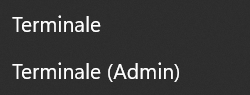

# Configurazioni Windows

Prima di addentrarci nel mondo della programmazione, sarebbe opportuno settare la nostro sistema operativo per poter programmare in totale serenità. Le seguenti guide consentiranno di preparare correttamente il nostro Windows per la maggior parte delle situazioni ed operazioni che un programmatore affronta ogni giorno.

## Premesse

- La seguente guida è basata su Windows 11 Pro.
- Aggiornare costantemente Windows in quanto gli aggiornamenti portano dei benefici in termini di funzionalità, prestazioni e sicurezza.
- Nel caso usassimo delle shell del sistema come PowerShell, mantenerle aggiornate e documentarsi sulla loro sintassi e funzionalità.
- Le seguenti sono guide generiche. In caso di problemi, sarà necessario cercare online delle guide specifiche ed aggiornate. 

---

## Mostrare estensioni file e file nascosti

Lavoreremo sempre con dei file e le loro estensioni, quindi sarà indispensabile poterle vedere per manipolarle.

1. Aprire l'esplora risorse.
2. In alto troveremo il menu Visualizza.
3. Procedere alla voce Mostra, poi spuntare le caselle Estensioni nomi file ed Elementi nascosti:

---

## Mostrare Terminali nel menu contestuale

- É consigliato di avere a portata di mano i terminali. Si trovano premendo click destro sull'icona Start di Windows.

PS: Dovendo lavorare sempre con dei terminali, è consigliato aggiungerli alla barra inferiore delle applicazioni.

Per avere i terminali sempre a disposizione nel menu contestuale, ovvero quando clicchiamo con il tasto destro del mouse, seguire queste guide divise per terminali.

---

### PowerShell

Aggiungiamo il terminale PowerShell al menu contestuale, in quanto più moderno ed ha una sintassi più vicina ai sistemi Unix (anche se per una sitassi totalmente Unix possiamo usare **Git Bash**):

1. Aprire il menu Start e cerca "**Regedit**". Eseguire come amministratore "**Editor del Registro**".
2. Navigare fino alla seguente chiave del registro: `HKEY_CLASSES_ROOT\Directory\Background\shell`
3. Cliccare con il tasto destro sulla cartella "shell" e selezionare "**Nuovo**" > "**Chiave**".
4. Cliccare con il tasto destro sulla nuova chiave "**Win PowerShell**" (a nostra scelta) e selezionare "**Nuovo**" > "**Chiave**". Rinominare questa seconda chiave come "**command**".
5. Cliccare con il tasto destro sulla chiave "**command**" e selezionare "**Modifica**".
6. Nella finestra di modifica, inserire il seguente comando: `powershell.exe -noexit -command Set-Location -LiteralPath '%V'`
7. Questo comando renderà possibile a PowerShell di avviarsi nella directory corrente quando verrà selezionato dal menu contestuale.
8. Chiudiamo l'Editor del Registro. Adesso, possiamo provare ad aprire il menu contestuale del click destro del mouse. Dovrebbe comparire la voce "Win PowerShell" nella lista delle opzioni. Cliccando su di essa, si aprirà la finestra di PowerShell nella directory corrente.

---

### CMD

Nel caso volessimo aggiungere il terminale command prompt classico di Windows:

1. Aprire il menu Start e cerca "**Regedit**". Aprire "**Editor del Registro**" come amministratore.
2. Navigare fino alla seguente chiave del registro: `HKEY_CLASSES_ROOT\Directory\Background\shell`
3. Cliccare con il tasto destro sulla cartella "**shell**" e seleziona "**Nuovo**" > "**Chiave**". Rinominare la nuova chiave come "**Command Prompt**" oppure "**Terminale cmd**".
4. Cliccare con il tasto destro sulla nuova chiave "**Command Prompt**" (o come lo hai chiamato) e selezionare "**Nuovo**" > "**Chiave**". Rinominare questa seconda chiave come "**command**". Ci verrà creata una sottocartella command.
5. Cliccare con il tasto destro sulla cartella "**command**" e selezionare "**Modifica**".
6. Nella finestra di modifica, inserire il seguente comando: `cmd.exe /k cd /d "%V"`
7. Questo comando renderà possibile al terminale **cmd** di avviarsi nella directory corrente quando verrà selezionato dal menu contestuale.
8. Chiudi l'Editor del Registro. Adesso, possiamo provare ad aprire il menu contestuale del click destro del mouse e dovremmo riuscire a vedere "Command Prompt" come voce nella lista delle opzioni. Cliccando su di essa, si aprirà il terminale cmd nella directory corrente.