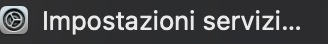
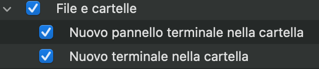
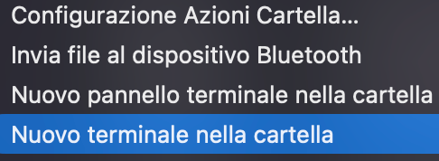
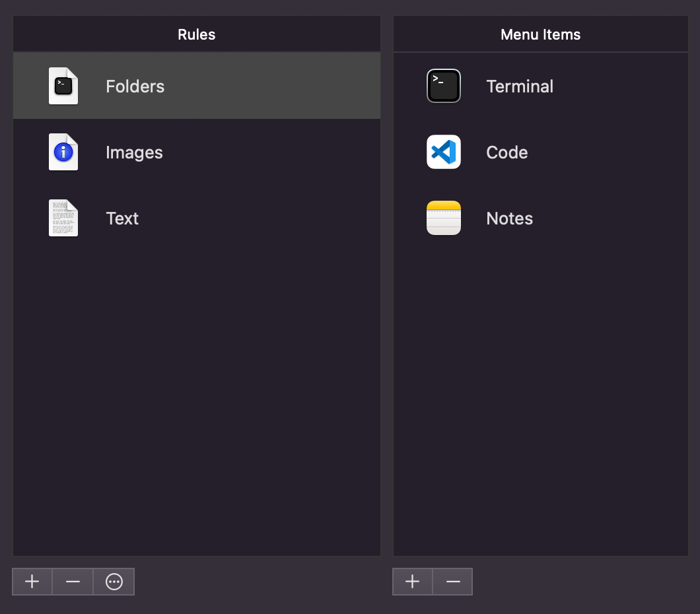
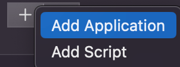
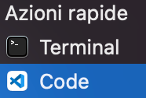
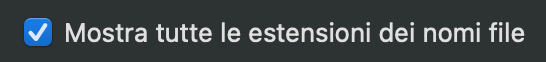
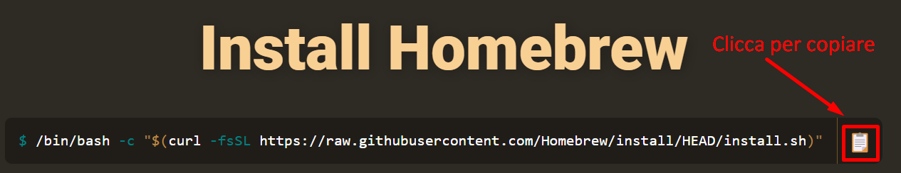
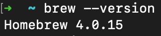
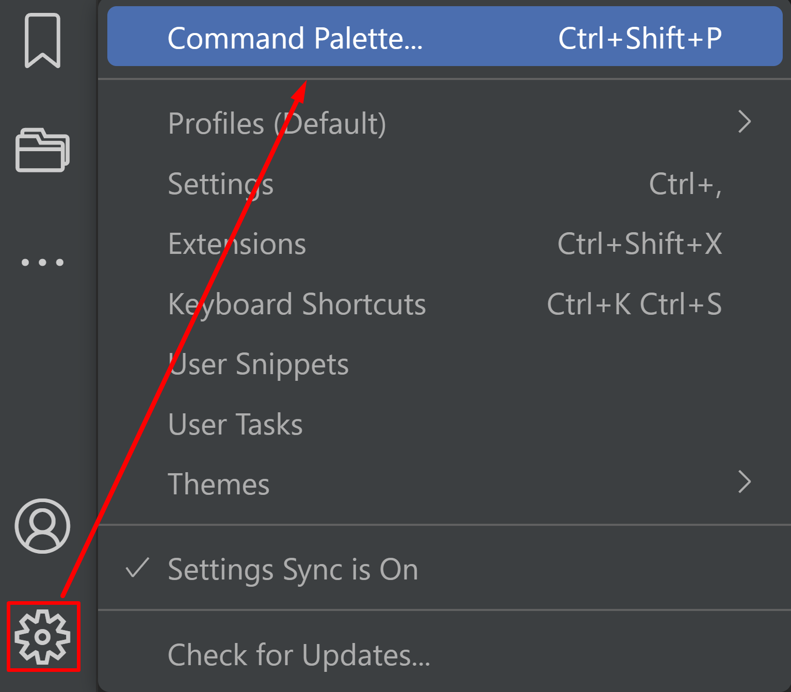

# Configurazioni macOS

Prima di addentrarci nel mondo della programmazione, sarebbe opportuno settare la nostro sistema operativo per poter programmare in totale serenità. Le seguenti guide consentiranno di preparare correttamente il nostro macOS per la maggior parte delle situazioni ed operazioni che un programmatore affronta ogni giorno.

## Premesse

- La seguente guida è basata su MacOS Ventura 13.3.1
- Potrebbe esserci richiesto di installare XCode, l'IDE di programmazione di Apple. In via preventiva è consigliato installarlo in quanto senza di esso potremmo non riuscire a lanciare degli script.
- In ogni caso, leggiamo sempre attentamente tutte le istruzioni di risposta dei terminali, e cerchiamo online delle soluzioni in quanto le versioni e procedure dei vari programmi cambiano continuamente.
- Le seguenti sono guide generiche. In caso di problemi, sarà necessario cercare online delle guide specifiche ed aggiornate. 

---

## Mostrare i terminali nel menu contestuale

Lavoreremo molto spesso con i terminali, ma di default non compaiono nel menu contestuale. Possiamo farli comparire in questo modo.

1. Aprire il **Finder**.
2. Nel menu in alto cliccare su **Servizi**.


3. Cliccare sulla voce in fondo **Impostazioni servizi…**



4. Abilitare queste impostazioni: **File e cartelle** > **Nuovo terminale nella cartella**. È consigliato controllare anche le altre impostazioni e modificare quelle che potrebbero far comodo:



5. Da adesso in poi, possiamo fare click destro direttamente sulla cartella di ogni progetti (o dove sarà necessario), e aprire il terminale il cui prompt punta esattamente a quella cartella.



---

## Aggiungere voci nel menu contestuale

Purtroppo, non è tanto semplice aggiungere delle voci al menu contestuale in macOS, ma possiamo usare l'app gratuita Service Station, scaricandola dall'App Store.

1. Una volta avviata, troveremo una schermata del genere.



2. A sinistra cliccare su **Folders** per indicare "quando faremo click destro sulle cartelle…"
3. Nel menu a destra, in basso, clicchiamo sul bottone `+`, e selezioniamo **Add Application**.



4. Cerchiamo nelle nostre applicazioni un IDE (ad esempio VSCode) e selezioniamo. Possibilmente, aggiungere anche il terminale **zsh** (si trova in **Applications/Utilities**).

Cosa abbiamo fatto? Qualcosa di estremamente comodo. Infatti, da adesso ogni volta che clicchiamo con il tasto destro su una cartella, tra le opzioni troveremo le app che abbiamo selezionato. Nel nostro caso avremmo aggiunto sia il terminale che VSCode.



Quindi possiamo aprire il terminale direttamente dalla cartella con il click destro su di essa, e questo punterà automaticamente alla cartella selezionata senza dover scrivere il percorso. Possiamo aprire finalmente il progetto con VSCode direttamente dalla cartella.

---

## Mostrare i percorsi dei file

Lavoreremo molto spesso con delle risorse nella nostra macchina, ma prima dobbiamo sapere dove si trovano. Seguiamo questa breve guida per mostrare i percorsi delle cartelle nel Finder.

1. Aprire il **Finder**.
2. Nella barra in alto trovare la sezione **Vista** e cliccarla.


3. Trovare l'opzione "**Mostra la barra del percorso**" e selezionarla.


4. Adesso il Finder mostrerà in basso una barra con i percorsi del file. Questi sono molto utili, specie in programmazione, per muoversi tra le cartelle. Un utilizzo lo vedremo tra poco durante l'installazione di Homebrew. 

==NB==: Diamo un'occhiata alle altre voci del menu vista (possibilmente di ogni menù in generale) per scoprire qualche altra impostazione utile da modificare e attivare nel nostro macOS.

---

## Mostrare le estensioni dei file

Il lavoro da programmatore prevede di lavorare sempre con dei file di diversa natura. In alcune occasioni, sarà fondamentale vedere l'estensione dei file per eseguire varie operazioni su di loro.

 Per modificare le estensioni dei file:

1. Aprire il **Finder**.
2. Nel menu in alto cliccare su **Impostazioni**, oppure premere `Cmd +` ,
3. Nella scheda **Avanzate** attivare l'opzione "**Mostra tutte le estensioni dei nomi file**".



---

## Installare Homebrew

Per tutti i software da scaricare sul nostro Mac, questo corso si affida ad Homebrew. Homebrew è un gestore di pacchetti software che ci consentirà di installare tutti i programmi che ci serviranno, utilizzando il terminale come interfaccia per lanciare istruzioni come la ricerca e l'installazione. Questo ci evita di andare a cercare ogni programma su ogni sito e installarlo manualmente (come accade su Windows).

Seguire questa procedura:

1. Aprire un terminale.

2. Rechiamoci al sito ufficiale [https://brew.sh/](https://brew.sh/) e copiamo la prima riga nella sezione "Install Homebrew".



3. Di seguito è riportata la stringa per comodità. Incollare tutta questa stringa evidenziata (Tranne il simbolo del dollaro $ iniziale) dentro il terminale e premere `Invio` per installare:

```sh
/bin/bash -c "$(curl -fsSL https://raw.githubusercontent.com/Homebrew/install/HEAD/install.sh"
```

4. Ci verrà chiesta la password del nostro macOS. Inseriamo e premiamo `Invio`. Attendere l'installazione.


5. Una volta installato Homebrew, nel terminale compariranno due stringhe da copiare e incollare per aggiungere le nuove variabili d'ambiente. Questo consentirà al nostro Mac di poter utilizzare i comandi di Homebrew (ovvero la parola chiave brew che attiva i servizi di Homebrew) in ogni parte della nostra macchina.

6. Al termine dell'installazione, verificare che Homebrew sia installato correttamente. Per farlo, generalmente si controlla la versione del software. È un modo di verificare sia se il software sia stato installato correttamente, sia la sua versione operativa attuale.
	- Per scoprire dunque la versione di brew, scrivere nel terminale `brew --version`
	- Se tutto è stato installato correttamente, il terminale ci risponderà con la versione corrente di brew:



- Qualora non dovesse comparire la versione ma dei messaggi di errore, abbiamo tre opzioni:
	- Leggere l'errore perché spesso ci darà anche la soluzione per risolverlo;
	- Chiedere aiuto all'insegnante;
	- Cerca l'errore online sui vari siti o tramite un chatbot AI, e cerca una possibile soluzione.

---

## Aprire un percorso nascosto

Mettiamo caso di voler scoprire il percorso d'installazione di un qualsiasi programma. Probabilmente, lo avremmo installato con Homebrew, ma non riusciamo a trovare la sua cartella.

1. Digitiamo nel terminale `which nome-programma` per mostrare il percorso d'installazione. Sostituire "nome-programma" con il programma da cercare.
2. Se lo trova, il terminale ci mostrerà il percorso d'installazione. Copiamolo.
3. Apriamo il **Finder** ed usiamo la combo `Shift + Cmd + G` ed immettiamo il percorso.
4. Ci verrà aperta la cartella nascosta.

---

## Mostrare file nascosti

==NB==: la seguente procedura è molto invasiva. Questa procedura consentirà di mostrare tutti i file e le cartelle nascoste che servono a far funzionare il nostro OS. Una modifica sbagliata potrebbe causare seri problemi alla macchina e ai dati contenuti.

Dunque, perché mostrare tutti i file nascosti? A volte, potrebbe essere necessario modificarli o eliminarli. Un esempio sarà la cartella `.git` che useremo per creare una repository di Git, che collega anche la repository locale con quella in remoto su GitHub.

Una prima alternativa più semplice è aprire il **Finder** e digitare il comando `Cmd + Shift + .` (punto), da usare sia per mostrare che rimuovere file e cartelle nascoste.

In alternativa, possiamo usare il terminale:

- Aprire un terminale e digitare il seguente comando per mostrare tutti i file nascosti.

```sh
defaults write com.apple.finder AppleShowAllFiles true; killall Finder
```

- Per nasconderli nuovamente, digitare:

```sh
defaults write com.apple.finder AppleShowAllFiles false; killall Finder
```

---

## Installare il comando "code" per i terminali

Uno dei modi per aprire con Visual Studio Code una cartella da terminale, è digitare al suo interno il comando "`code`". Tuttavia, questo comando potrebbe non essere installato sul nostro mac dopo l'installazione di VS Code. Abbiamo due guide da poter seguire.

---

### Installare il comando code

1. Aprire **Visual Studio Code**.

2. Aprire il menu "**Command Palette**" premendo la combo di tasti `Shift + Command + P` sulla tastiera, oppure trovare la voce dall'icona delle impostazioni nell'angolo in basso a sinistra di VSCode.



1. Digitare "`shell command`" nella finestra di ricerca del menu che comparirà in alto.

2. Fare clic sull'opzione "**Shell Command: Install 'code' command in PATH**" nel menu.

3. Attendere che il processo di installazione termini.

4. Chiudere e riaprire il terminale. Dopo aver seguito questi passaggi, il comando "`code`" dovrebbe essere attivato da terminale e dovrebbe aprire Visual Studio Code quando viene digitato.

5. Controlliamo che tutto sia stato installato correttamente:
	- Su una qualsiasi cartella o area del Mac, premere click destro e selezionare la voce **Terminale**.
	- Nel terminale che si aprirà digita `code .` (il punto significa "quest'area", quindi la cartella indicata nel prompt del terminale. Il comando `code .` significa dunque "Apri questa cartella tramite VS Code").
	- Se si aprirà Visual Studio Code nell'area della cartella in cui è stato lanciato il terminale, allora il comando è stato correttamente installato.

---

### Reinstallare il comando code

Potrebbe sorgere un errore durante l'installazione del comando che si chiama **ENOTDIR**.

L'errore "`ENOTDIR: not a directory, stat '/usr/local/bin/code'`" indica che il percorso "`/usr/local/bin/code`" non è una directory (una cartella), ma un file. Di solito, questo errore si verifica quando si tenta di installare il comando "code" in una directory non valida.

Per risolvere il problema, possiamo provare a disinstallare il comando "code" e reinstallarlo nuovamente seguendo questi passaggi:

1. Aprire Visual Studio Code.
2. Aprire il menu "Command Palette" premendo i tasti Shift + Command + P.
3. Digitare "shell command" nella finestra di ricerca del menu che comparirà in alto.
4. Fare clic sull'opzione "Shell Command: Uninstall 'code' command" nel menu a discesa che appare.
5. Chiudere e riaprire il terminale.
6. Aprire di nuovo Visual Studio Code.
7. Aprire il menu "Command Palette".
8. Digitare "shell command" nella finestra di ricerca del menu che comparirà in alto.
9. Fare clic sull'opzione "Shell Command: Install 'code' command in PATH" nel menu.
10. Attendere che il processo di installazione termini.
11. Chiudere e riaprire il terminale.

Dopo aver seguito questi passaggi, il comando "code" dovrebbe essere installato correttamente e funzionare correttamente da terminale.