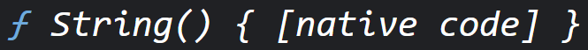
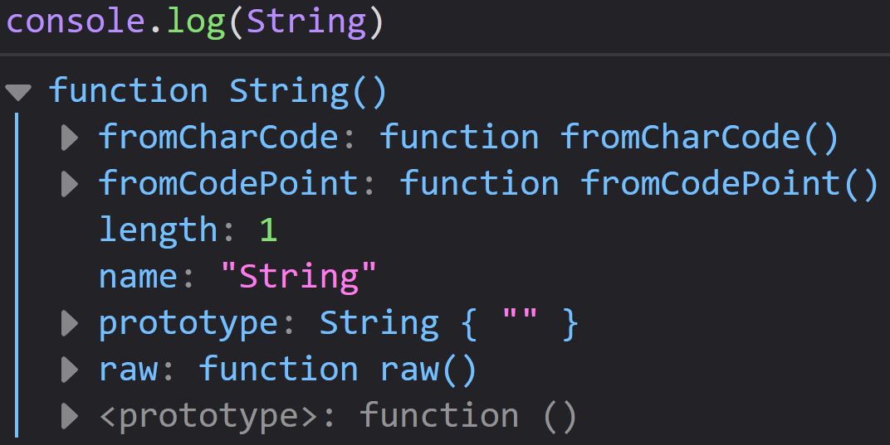
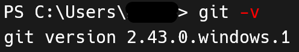
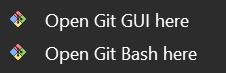
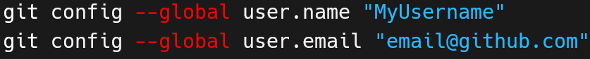
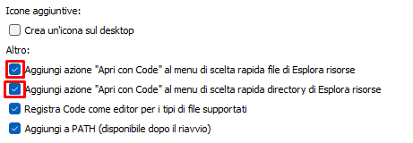
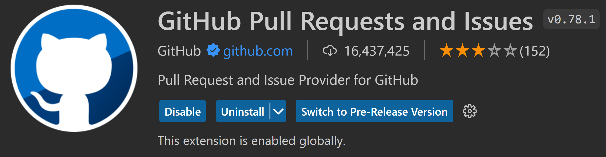
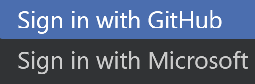

# Differenze tra browser

Per sviluppare siti e applicazioni web, qualsiasi browser in generale va bene. Tuttavia, alcuni browser sono più indicati di altri, specie all'inizio. Prendiamo questo esempio di un codice in JavaScript.


In browser come Google Chrome, Brave, Microsoft Edge (tutti basati su ChromiumV8) il risultato sarà:



Sicuramente il risultato é corretto, in quanto String è una classe di JavaScript. Tuttavia, lo stesso risultato sul browser Mozilla Firefox mostrerà molte altre proprietà e metodi interne alla classe String, rendendo molto più dettagliata la risposta.



La scelta del browser è totalmente personale, ma Mozilla è consigliato particolarmente all'inizio perché fornisce dei dettagli che possono aiutare gli studenti.

---

# Git

**Git** è un sistema di controllo versione (**VCS**, **Version Control System**) distribuito (**DVCS**) utilizzato per gestire il codice sorgente di un progetto software. È stato creato da Linus Torvalds nel 2005 per gestire lo sviluppo del kernel Linux, ma è diventato uno degli strumenti più popolari per il controllo di versione del codice sorgente.

Git consente ai programmatori di tenere traccia delle modifiche apportate al codice sorgente, mantenere diverse versioni del codice in modo organizzato e collaborare con altri programmatori in modo efficiente. Il sistema di controllo versione Git permette di tenere traccia di tutti i cambiamenti apportati al codice sorgente, mantenere un registro delle modifiche, gestire le versioni del codice e collaborare con altri programmatori in modo efficiente.

Git è un sistema di controllo versione distribuito, il che significa che **ogni utente ha una copia completa del repository del progetto sul proprio computer**. Questo consente di lavorare offline, senza dover essere sempre connessi a Internet, e di avere un'interazione più veloce e fluida con il repository.

Inoltre, Git è un sistema di controllo versione molto flessibile, in grado di gestire progetti di qualsiasi dimensione e complessità. Questo lo rende uno strumento popolare per la gestione del codice sorgente in molti progetti software, sia per le piccole applicazioni che per i grandi progetti open source.

---

## Installazione Git

Guida ufficiale: [https://git-scm.com/downloads](https://git-scm.com/downloads)

### Windows

1. Installare Git da questo link: [https://git-scm.com/download/win](https://git-scm.com/download/win)
2. Durante l'installazione possiamo anche installare Git Bash, una shell di terminale che ci servirà in seguito.
3. Sempre avanti e terminare l'installazione.
4. Verificare che l'installazione è andata a buon fine digitando in un terminale: `git --version`

### MacOS

1. Installare Homebrew (vedere la guida specifica).
2. Installare Git scrivendo nel terminale: `brew install git`
3. Verificare che l'installazione è andata a buon fine digitando: `git --version`

### Linux (Debian based)

1. Aggiornare apt: `sudo apt update`
2. Installare git: `sudo apt install git`
3. Verificare che l'installazione è andata a buon fine digitando: `git --version`

==NB==: In programmazione non possiamo dare nulla per scontato, neanche l'installazione di un programma. Come anticipato nelle guide d'installazione a Git, da adesso in poi ogni volta che installiamo qualsiasi software, specialmente da linea di comando (da terminale), dobbiamo acquisire l'abitudine di vedere se il software è stato correttamente scaricato, installato ed è funzionante come ci aspettiamo.

Nella maggior parte dei casi, la convenzione vuole che si mostri la versione del programma installato. Questo specialmente perché tutti i programmi hanno l'opzione `--version`, spesso abbreviata in `-v`, ma dipende dal comando installato.

Ad esempio, per scoprire la versione di Git, digitiamo `git --version` oppure `git -v`. In entrambi i casi, se il terminale ci risponde mostrando la versione di Git, significa che il programma è sia installato correttamente e conosciamo anche la versione installata.



---

## Git Bash

Durante l'installazione di Git, abbiamo l'opzione di installare anche Git Bash, una shell da terminale basata su Unix. Questa shell ci permette di utilizzare comandi in stile Unix all'interno di un terminale su sistemi operativi Windows.

Una volta installato Git, dovremmo avere sia la **GUI** (interfaccia grafica) che **Git Bash** (la shell del terminale) disponibili nel menu contestuale del mouse, ovvero quando clicchiamo con il tasto destro su una cartella o su un file. La GUI non è essenziale, ma Git Bash è consigliato installarlo, specialmente da Windows, in quanto i suoi terminali hanno una sintassi abbastanza lontana ai sistemi Unix Like, che invece sono comuni sui sistemi Linux e macOS.



L'uso di Git Bash offre diversi vantaggi:

- Utilizzando Git Bash, possiamo uniformare la sintassi dei comandi del terminale su qualsiasi sistema operativo. Questo ci evita la necessità di imparare le sintassi specifiche di altre shell, come PowerShell su Windows o zsh su macOS, se lavoriamo frequentemente con diversi sistemi operativi.

- Il secondo vantaggio lo troviamo quando effettuiamo il deploy di un'applicazione, come la distribuzione online di un sito web. Nella maggior parte dei casi, gli host server remoto utilizzano OS basati su distribuzioni Linux. Avendo familiarità con i comandi Unix grazie alla pratica con Git Bash, ci risulterà molto più semplice configurare questi server per ospitare la nostra applicazione.

==PS==: va comunque detto che la shell di macOS, zsh (Z Shell), si basa su Unix e condivide molte caratteristiche e comandi con bash, Bourne Again SHell, che è la shell predefinita su molte distribuzioni di Linux e su macOS fino alla versione Catalina (dopo la quale zsh è diventata la shell predefinita). Saranno veramente pochi i comandi che cambieranno tra zsh e Git Bash.

---

# GitHub

Qualora volessimo salvare i nostri progetti in **locale** (sul nostro computer), esistono diversi cloud specifici che possono accogliere e conservare i nostri progetti (**repository**), preservandone il codice. Questi vengono definiti **Git Client**, perché si basano sul VCS **Git**, una tecnologia di versionamento del codice che impareremo a conoscere nel tempo, ma che abbiamo già installato.

Tra i più conosciuti abbiamo BitBucket, GitLab, AWS CodeCommit, ma il più famoso ed utilizzato di tutti è GitHub, nonché quello che utilizzeremo in questo corso.

Creiamo dunque un account gratuito su GitHub: [https://github.com/](https://github.com/)

Questo ci consentirà di poter caricare i progetti di programmazione sul proprio account, scaricarli quando ci serviranno anche su altri dispositivi, permettere ad un insegnante di vedere il proprio codice per delle correzioni, e anche di che poter collaborare con altre persone ai propri progetti o ai loro (codice open-source).

---

## Configurazione account Git in locale

Una volta installato Git, sarà necessario configurare l'account Git locale (nella nostra macchina) inserendo le nostre credenziali Git. Queste informazioni servono a identificare l'autore dei **commit** (i salvataggi nella storia del progetto), che sono essenziali in una repository.

Dato che abbiamo creato un account GitHub, è una buona prassi identificarsi con le **stesse credenziali**.

Apriamo un terminale e digitiamo questi comandi:



Di seguito, sono riportati i comandi da scrivere nel terminale qui in basso. modificare solo i valori dentro i doppi apici inserendo gli stessi dati dell'account GitHub:

```sh
git config --global user.name "Proprio Nome"
git config --global user.email "email@github.ext"
```

Queste informazioni non sono direttamente collegate all'account GitHub, ma è consigliabile utilizzare le stesse credenziali.

---

# Cos'è un IDE e a cosa serve

Un ambiente di sviluppo integrato (Integrated Development Environment o IDE) è un software che ci aiuta a scrivere, testare e debuggare il codice. L'IDE fornisce un'interfaccia utente grafica per semplificare il processo di sviluppo, consentendoci di scrivere codice più velocemente e con meno errori.

Un IDE generalmente fornisce strumenti quali: un editor di testo, un debugger, il deploy, l'automazione della build. Sia chiaro, potremmo scrivere codice anche con un semplice blocco note, specialmente per la programmazione web, ma gli IDE offrono degli editor molto comodi che automatizzano e aiutano nella scrittura di codice funzionante, oltre che essere una soluzione professionale.

---

## Quale IDE utilizzare?

Ne esistono decine, tra gratuiti e a pagamento, più o meno performanti e specifici per uno scopo oppure più trasversali. Ogni IDE ha le sue peculiarità, vantaggi e svantaggi. Alcuni IDE sono open-source e installabili su ogni sistema operativo, altri sono proprietari di aziende e sono stati sviluppati per lavorare solo su determinati sistemi operativi.

Vediamo alcuni dei più comuni e consigliati:

- Atom (oramai dismesso).
- Visual Studio (Microsoft - Nativo).
- Visual Studio Code è il fratellino minore di Visual Studio, spesso abbreviato in VSCode, è il più utilizzato al mondo.
- Xcode (Mac - Nativo).
- PhpStorm, WebStorm, IntelliJ e molti altri di JetBrains.
- Sublime.
- Vim e NeoVim, ma sono usati per tecnici smanettori.
- Eclipse o NetBeans per Java.
- Zed: un nuovo IDE estremamente veloce basato su Rust.

----

## IDE consigliato: Visual Studio Code

Visual Studio Code (abbreviato in VSCode) è un editor di codice sorgente sviluppato da Microsoft per Windows, Linux e macOS. Basato su Electron, un framework che permette di creare applicazioni desktop utilizzando tecnologie web come HTML, CSS e JavaScript. Visual Studio Code è un IDE leggero e versatile, con un'ampia gamma di estensioni disponibili per personalizzare e ottimizzare l'esperienza di sviluppo.

In questo corso è fortemente consigliato utilizzare VSCode perché è cross-platform e tra i più semplici e leggeri esistenti, ottimi per la didattica, oltre che essere l'IDE più usato al mondo. Procediamo dunque all'installazione di VSCode sul nostro sistema operativo [https://code.visualstudio.com/](https://code.visualstudio.com/)

Durante il processo d'installazione, ci imbatteremo in questa finestra. Spuntiamo le prime due caselle per rendere possibile aprire un file o cartella direttamente con Visual Studio Code, facendo un click destro su di essi. Questa è una funzionalità molto comoda che non è attiva per impostazione predefinita.



==NB==: Indipendentemente dall'IDE che decideremo di usare, dobbiamo tener presente che questo sarà il software che useremo per la maggior parte del tempo. È il corrispettivo di una penna per uno scrittore, o di una chitarra per un chitarrista. Per questo motivo, investiamo parte del nostro tempo nell'esplorazione e la sperimentazione delle varie funzionalità di questo strumento. Online si trova sempre di tutto, dalle guide ufficiali ai vari trucchetti fondamentali per la produttività, alle estensioni che caratterizzano questo IDE.

---

## Alternative: IDE online

Negli ultimi anni stanno comparendo sempre più editor online. Sono particolarmente indicati per questi motivi:

- Tutto viene sincronizzato sul nostro account online. Quindi non dobbiamo preoccuparci di scaricare programmi sul nostro dispositivo, configurarli e farli funzionare.

- Possiamo accedere con qualsiasi dispositivo in ogni luogo, ci basta una buona connessione ad Internet e la nostra macchina.

- Evitiamo quindi anche possibili problemi di bug delle versioni, come incompatibilità tra programmi e sistemi operativi, in quanto tutto funziona su un browser.

- Spesso, possiamo eseguire dei fork, ovvero duplicare il progetto di un altro programmatore e partire con del codice già funzionante per sperimentare.

- Esistono comunque degli svantaggi. Ad esempio, non siamo particolarmente indicati per lavori complessi, o se utilizziamo particolari tecnologie che potrebbero non essere implementate nel sito. In quel caso, lavoriamo in locale.

### Editor online consigliati

Esistono molte valide alternative online, che ci consentono di sviluppare anche su un browser senza dover installare nulla.

- Replit: [https://replit.com/](https://replit.com/) dalla collaborazione con i creatori di FreeCodeCamp, possiamo utilizzare questo editor online per esercitarci in tantissimi linguaggi di programmazione e framework anche senza installare un IDE.

- Codespace: [https://github.com/features/codespaces](https://github.com/features/codespaces) un'IDE online di GitHub che ci consentirà di accedere ai nostri progetti direttamente da browser.

- Codepen: [https://codepen.io/your-work](https://codepen.io/your-work) Molto utile per progetti ed esercitazioni molto veloci.

- StackBlitz: [https://stackblitz.com/](https://stackblitz.com/)

- CodeSandbox: [https://codesandbox.io/](https://codesandbox.io/)

---

# Collegare GitHub a Visual Studio Code

Collegando Visual Studio Code al nostro account remoto GitHub, ci verrà consentito di salvare i nostri progetti online, scaricarli su altri dispositivi, tornare indietro con le modifiche, lavorare con altri programmatori e così via. Inoltre, risulta particolarmente utile a livello didattico per le correzioni degli esercizi.

Seguiamo questi passaggi:

1. Apriamo Visual Studio Code e cerchiamo nel marketplace la seguente estensione. Le estensioni si possono scaricare cliccando su questa icona che si trova sul bordo in verticale dell'applicazione:


2. Cerchiamo e installiamo l'estensione "**GitHub Pull Requests and Issues**" dal marketplace.



3. Sempre sul bordo ma in basso questa volta, noteremo questa icona del nostro profilo. Cliccandola, potremo selezionare la voce per accedere a un account. Consigliamo quello di GitHub.


4. In alto, uscirà un menù con delle modalità di login. Clicchiamo su "**accedi con GitHub**", dovrebbe anche uscire un bottone a destra da cliccare.



5. Si aprirà una finestra del browser dove ci verrà chiesto l'accesso al nostro account GitHub e poi di connettere l'estensione appena scaricata all'account GitHub. Clicchiamo su **Authorize GitHub**. Possiamo chiudere ora la pagina web.

6. Torniamo sull'icona del nostro profilo e controlliamo che abbiamo effettuato l'accesso. Nel caso, accediamo nuovamente o anche riavviamo VSCode e ritentiamo l'accesso.

In questo momento, abbiamo sincronizzato VSCode in locale con il nostro account GitHub in remoto. Questo avviene grazie ai servizi offerti da Git.