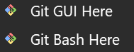
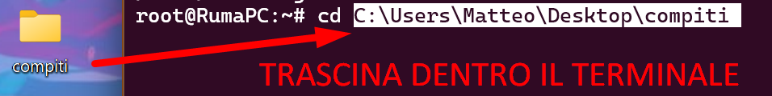

# Introduzione a Git Bash e comandi di base

Da programmatori ci troveremo sempre a lanciare comandi dal terminale, ad esempio per usare Git, gestire i repository, o per lanciare altri applicativi. Uno dei problemi iniziali è che ogni sistema operativo ha diversi "terminali" e ognuno con una propria sintassi.

In realtà si chiamano **Shell**: il terminale è l'interfaccia del programma dove scrivete linee di comando, mentre la shell è l'**interprete** dei comandi come Bash, ZSH, CMD e PowerShell.

Per quanto riguarda gli utenti Linux e MacOS non c'è problema in quanto le loro shell sono Unix Like. I terminali di Windows invece hanno una sintassi tutta loro. PowerShell è più vicino alle sintassi Unix Like, quindi qualche comando è supportato ma molti altri non funzionano.

I vari programmi che impareremo ad usare (come Git) sono tutti basati sulla Unix Like, il che significa che sarà importante conoscere l'interprete e la sintassi corretti.

---

## Installazione di Git + Git Bash

**Consigliato per chiunque utilizzi Windows di installare Git Bash**. È una shell che supporta la sintassi Unix Like e con il quale è possibile fare pratica in attesa di conoscere Git. [Questo video](https://www.youtube.com/watch?v=ankVyh-ELTo) spiega come installare Git Bash su Windows.

Una volta installato Git Bash, possiamo aprirlo da PowerShell scegliendo GitBash come shell. A questo punto possiamo fare pratica con i comandi con [questo corso gratuito](https://www.udemy.com/course/linux-comandi-base/learn/lecture/16444940#overview) sono sufficienti le prime 2-3 sezioni. Di seguito è riportata anche una breve guida sui comandi più importanti per muoversi in una shell Bash.

>Corso consigliato [Corso introduttivo di Git](https://youtu.be/wPAE9-DdMtI?si=de3pwmgI09eJVcif) per principianti. Non è necessario approfondire tutto, ma è importante capire i concetti base e come si usano i comandi principali.

---

# Git Bash

Git Bash è un'applicazione per i sistemi operativi Windows che fornisce un'interfaccia di linea di comando simile a quella di un terminale Unix. È basato su [MinGW] [http://www.mingw.org/](http://www.mingw.org/), una raccolta di strumenti di sviluppo open source che forniscono un ambiente di sviluppo simile a Unix su Windows. Git Bash include il comando git, che consente di utilizzare il sistema di controllo versione Git direttamente dal terminale.

Ecco alcuni dei vantaggi di utilizzare Git Bash:

- Familiarità per gli utenti Unix/Linux: Se siamo abituato a lavorare con un terminale Unix o Linux, Git Bash offre un'esperienza simile su Windows, rendendo più facile l'adozione di Git e l'utilizzo del controllo versione.

- Automazione: Utilizzando il terminale Git Bash, è possibile scrivere script bash per automatizzare compiti ripetitivi o processi di sviluppo. Questo può aiutare a migliorare la produttività e ridurre gli errori umani.

- Controllo completo su Git: Il terminale Git Bash consente di eseguire tutti i comandi Git disponibili, dandoci il pieno controllo sul nostro repository e sulla nostra cronologia delle versioni. Alcune funzionalità avanzate di Git potrebbero non essere accessibili attraverso le interfacce utente grafiche (GUI).

- Personalizzazione: Possiamo personalizzare l'aspetto e il comportamento del terminale Git Bash, come ad esempio i colori, il prompt e gli alias dei comandi.

- Integrazione con strumenti di sviluppo: Molti editor di codice e ambienti di sviluppo integrato (IDE) supportano l'integrazione con il terminale Git Bash, consentendo di utilizzare i comandi Git direttamente all'interno dell'editor o dell'IDE.

- Supporto per la community: Git Bash è supportato da una vasta comunità di sviluppatori, il che significa che è probabile che possiamo trovare risorse utili e risposte alle domande mentre lo utilizzi.

- Operazioni Windows: è possibile eseguire alcuni comandi di Windows all'interno di Git Bash, anche se potrebbero esserci alcune limitazioni e differenze nel comportamento rispetto all'utilizzo di un prompt dei comandi nativo di Windows (CMD) o PowerShell. Sostanzialmente, utilizzeremo Git Bash principalmente come terminale per gestire le nostre future repository, piuttosto che avviare comandi per il nostro sistema operativo.

Per eseguire comandi di Windows in Git Bash, possiamo utilizzare o gli alias o scrivendo il prefisso `cmd.exe /c`.

Aggiungere `cmd.exe /c` prima del comando di Windows che desideriamo eseguire. Ad esempio, per eseguire il comando `ipconfig`, digitiamo `cmd.exe /c ipconfig` nel terminale Git Bash.

Il prefisso `cmd.exe /c` avvia un'istanza del prompt dei comandi di Windows per eseguire il comando specificato.

---

# Primi passi sul terminale

Qualora avessimo già scaricato Git correttamente avremmo a disposizione le voci Git Bash Here e Git GUI Here nel menu contestuale. Quindi cliccare con il pulsante destro su un'area come il Desktop o una cartella, poi selezioniamo la voce **Git Bash Here**.



Verrà aperto un terminale Git Bash.

---

## Dentro il terminale Git Bash

Aperto il terminale, vedremo il prompt che ci mostra una riga come questa:


Possiamo notare:

- `Matteo`: è il nome utente, che indica l'identità dell'utente attualmente connesso al sistema.

- `@RumaPC`: RumaPC è il nome del computer o del sistema a cui sei connesso. Il simbolo `@` separa il nome utente dal nome del computer.

- `MINGW64`: indica che si sta utilizzando un ambiente MinGW-w64. MinGW-w64 è una distribuzione di strumenti di sviluppo GNU per Windows che include un compilatore per C, C++ e altri linguaggi, oltre a utilità come Bash. Questa informazione indica che Git Bash sta utilizzando l'ambiente MinGW-w64 per fornire un'esperienza simile a quella di un terminale Unix su Windows.

- `~`: è una rappresentazione simbolica della propria directory **home**. Nel contesto di Git Bash su Windows, la directory home è di solito la cartella **C:\Users\Username**. Quando navighiamo in altre directory, vedremo che il simbolo `~` viene sostituito dal percorso relativo alla directory corrente. Ad esempio come sta accadendo con `~/Desktop`.

- `(master)`: indica il nome del branch corrente nel nostro repository Git. In questo caso, ci troviamo nel branch "master". Se navigassimo in una directory dove non è presente un repository Git o in una directory che non ha un branch attivo, questa informazione potrebbe non essere visualizzata.

---

## Combinazioni da tastiera e mouse

| **Comando**      | **Descrizione**                  |
| ---------------- | -------------------------------- |
| Ctrl + Shift + N | Aprire nuova finestra terminale. |
| Ctrl + Shift + W | Chiude il terminale.             |
| Ctrl + Ins       | Copia                            |
| Shift + Ins      | Incolla                          |

NB: Alcune azioni possono essere effettuate anche con il click del mouse destro nel terminale.

>Consiglio: Se ci troviamo su Windows possiamo utilizzare il terminale PowerShell aprendo una scheda di Git Bash. In questo modo saremo in grado di utilizzare combinazioni di comandi basici come Ctrl + C e Ctrl + V per copiare ed incollare.

---

# Best practice

- Autocompletamento: Dopo aver scritto qualche lettera di un comando, premendo il tasto TAB spesso il comando viene auto completato.

- Cronologia: Possiamo usare le frecce direzionali sopra e sotto per spostarci nei vari comandi precedentemente lanciati durante la sessione.

- Trovare nella cronologia: Digitando Ctrl + r, possiamo digitare qualche lettera per trovare nella cronologia quali comandi hanno al loro interno quelle lettere.

- Manuale del comando: Ogni comando ha un piccolo manuale di istruzioni (nei terminali Unix-like). Basta scrivere il prefisso `man` ad ogni comando. Ad esempio: `man mkdir`. Questi manuali però sono molto tecnici, e spesso si fa prima a cercare su internet.

- Riavviare: Quando si installano dei pacchetti, aggiornamenti, modifiche dei server locali e così via, spesso le modifiche non vengono applicate a quella sessione del terminale. Sarà dunque necessario aprire una nuova finestra del terminale per vedere effettivamente le nuove modifiche applicate.

- Imparare gli shortcut da tastiera: Ci sono diversi shortcut da tastiera che possono semplificare e velocizzare l'uso del terminale. Ad esempio, possiamo utilizzare Ctrl + C per interrompere un comando in esecuzione o Ctrl + R per cercare nella cronologia dei comandi.

- Organizza i file e directory: Mantiene i file e le directory organizziamoci in modo logico e coerente. Questo può facilitare la navigazione nel sistema e la ricerca di ciò di cui hai bisogno.

- Eseguire comandi con privilegi elevati con cautela: Quando eseguiamo comandi con privilegi elevati (ad esempio, utilizzando sudo su Unix-like o avviando un prompt dei comandi con privilegi di amministratore su Windows), facciamo attenzione ai comandi che eseguiamo. I comandi con privilegi elevati possono causare danni irreparabili al sistema se non vengono utilizzati correttamente.

- Mantenere il sistema aggiornato: Assicuriamoci che il sistema operativo e i software siano sempre aggiornati con le ultime patch di sicurezza e correzioni di bug. Questo può aiutare a prevenire problemi e proteggere il sistema dalle minacce alla sicurezza.

- Fare il backup dei dati: Eseguire regolarmente il backup dei nostri dati importanti su un'unità esterna o un servizio di archiviazione cloud. In caso di problemi con il sistema, avremo sempre una copia dei nostri dati a cui accedere.

- Utilizzare strumenti e utility aggiuntivi: Esplorare e utilizzare strumenti e utility aggiuntivi che possono migliorare la nostra esperienza con il terminale, come terminal multiplexer (ad esempio, tmux o screen), colorazione della sintassi, e integrazioni con altri strumenti di sviluppo.

---

# Navigazione in Git Bash

---

## Cosa sono i percorsi

Un **percorso** (path) indica la posizione di un file o una directory all'interno del **file system** (spazio del sistema operativo dove risiedono file e cartelle). Esso specifica come raggiungere un certo file o cartella a partire da un determinato punto di partenza (directory corrente o root del file system).

I percorsi sono fondamentali per eseguire operazioni su file e cartelle all’interno della shell come `Git Bash`, poiché molti comandi richiedono di sapere dove si trova il file su cui si vuole operare.

---

## Percorsi assoluti e relativi

### Percorso assoluto

Un **percorso assoluto** è un path completo che parte dalla **root del file system** e specifica ogni directory fino al file/directory desiderato. Non dipende dalla directory corrente.

Esempio su Git Bash in ambiente Windows:

```
/c/Users/NomeUtente/Progetti/GitRepo/
```

Qui `/c` rappresenta il disco `C:`.

### Percorso relativo

Un **percorso relativo** è espresso in relazione alla **directory corrente**. È più compatto e viene interpretato a partire dalla posizione attuale.

Esempi:

```
./documenti         # directory 'documenti' nella directory corrente
../progetti         # directory 'progetti' al livello superiore
scripts/setup.sh    # file 'setup.sh' dentro 'scripts' nella directory corrente
```

---

## Comandi Bash di navigazione

### Comando `pwd`

Il comando `pwd` (_print working directory_) mostra il **percorso assoluto della directory corrente**.

```bash
pwd
```

Esempio di output:

```
/c/Users/NomeUtente/Progetti/GitRepo
```

Utile per sapere dove ci si trova nel file system prima di eseguire altri comandi.

>Suggerimento: spesso è possibile trascinare un file o una directory nella shell e questo incollerà automaticamente il percorso assoluto



---

### Comando `cd`

Il comando `cd` (_change directory_) serve a **cambiare la directory corrente**. Accetta sia percorsi assoluti che relativi.

```bash
cd /c/Users/NomeUtente/Progetti     # percorso assoluto
cd documenti                        # percorso relativo
cd ..                               # spostamento alla directory superiore
cd                                  # ritorna alla home dell’utente
```

---

## Spostarsi con il comando `cd`

Il comando `cd` può essere usato in vari modi per navigare velocemente nel file system:

- `cd nome_cartella` → entra nella cartella figlia specificata

- `cd ..` → si sposta **alla directory superiore**

- `cd ../../` → si sposta **due livelli sopra**

- `cd ~` oppure `cd` da solo → torna **alla home dell’utente**

- `cd -` → torna **alla directory precedente**


Combinando `cd` con `pwd` si può verificare facilmente la posizione nel file system e spostarsi in modo efficiente.

---

## Suggerimenti per nomi cartelle e file

- Scrivere solo in minuscolo. Evita le lettere maiuscole.
- Evita caratteri speciali.
- Evita gli spazi. Vengono utilizzati come separatori di argomenti.
- Per legare le parole usare i trattini alti `-` oppure bassi `_`
- Se occorre mandare più parole come un unico argomento le puoi scrivere tra virgolette. es `cd "cartella 2"`
- Anche nel terminale esiste l'escape `\`

---

# Comandi Bash per listare, mostrare contenuti e cercare file in Git Bash

---

## Comandi per listare contenuti

### `ls`

Il comando `ls` (_list_) serve a **mostrare i contenuti di una directory**. Di default mostra solo nomi di file e cartelle.

```bash
ls                      # Elenca i contenuti della directory corrente
ls nome_cartella/       # Elenca i contenuti della directory specificata
```

Opzioni utili:

- `ls -l` → visualizzazione dettagliata (permessi, owner, dimensioni, data)

- `ls -a` → mostra anche file nascosti (iniziano con `.`)

- `ls -lh` → dettagli con dimensioni leggibili (KB, MB)

- `ls -R` → elenca ricorsivamente sottocartelle


Esempio:

```bash
ls -alh /c/Users/NomeUtente
```

---

## Comandi per mostrare contenuti di file

### `cat`

Il comando `cat` (_concatenate_) serve per **mostrare il contenuto completo di un file** di testo.

```bash
cat file.txt
```

Limiti: non è adatto a file molto lunghi perché mostra tutto in una volta.

---

### `less`

Il comando `less` è un **pager interattivo**, utile per leggere file lunghi in modo paginato.

```bash
less file.txt
```

Controlli base:

- Frecce ↑ ↓ o `PageUp`, `PageDown`

- `q` per uscire


---

### `head` e `tail`

- `head` mostra le **prime linee** di un file (default: 10)


```bash
head file.txt
head -n 20 file.txt      # mostra le prime 20 righe
```

- `tail` mostra le **ultime linee** (default: 10)


```bash
tail file.txt
tail -n 15 file.txt      # mostra le ultime 15 righe
```

Molto usato anche per log:

```bash
tail -f log.txt          # segue l’output in tempo reale
```

---

## Comandi per cercare file o contenuto

### `find`

Il comando `find` permette di **cercare file e cartelle nel file system**.

```bash
find . -name "file.txt"           # cerca file chiamati "file.txt" nella directory corrente e sottocartelle
find /c/Users -type d -name "git" # cerca directory chiamate "git" in modo ricorsivo
```

Altri usi:

```bash
find . -type f -name "*.md"       # tutti i file .md nella struttura corrente
```

---

### `grep`

Il comando `grep` cerca **testo all’interno di file**.

```bash
grep "parola" file.txt
grep -i "login" config.txt        # cerca ignorando maiuscole/minuscole
grep -r "pattern" .               # cerca ricorsivamente nei file nella directory corrente
```

Combina bene con `cat`, `less` o `find`.

Esempio:

```bash
find . -name "*.java" | xargs grep "public class"
```

Cerca "public class" in tutti i file `.java`.

---

## Altri comandi utili

- `clear` → pulisce lo schermo

- `history` → mostra la cronologia dei comandi usati

- `man comando` → (non sempre disponibile in Git Bash) apre la documentazione del comando, se supportato


Per ambienti Git Bash su Windows, `man` può essere assente: usare `--help` al posto:

```bash
grep --help
find --help
```