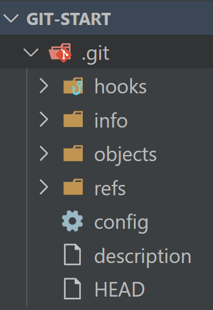

# **Cos'è Git**

Git è un sistema di controllo versione distribuito gratuito e open source progettato per gestire tutto, dai progetti piccoli ai molto grandi, con velocità ed efficienza. È stato creato da Linus Torvalds nel 2005 per lo sviluppo del kernel Linux, in quanto sosteneva che i software che venivano utilizzati fino a quel momento, non erano sufficientemente versatili per i Linux.

---

## Origini della parola

La parola "git" ha un significato particolare nel contesto dello sviluppo dei software. Quando Linus Torvalds, il creatore di Git (e del kernel Linux), ha nominato il sistema di controllo versione, ha usato la parola "git", che è un termine gergale britannico che può essere tradotto come "stupido" o "sgradevole". In un messaggio del 2005, Torvalds ha dichiarato: "Sto un po' alla larga dalla terminologia standard del controllo versione, perché tutti sanno che sono un perfetto git."

Quindi, il nome "Git" è un po' una battuta interna. Tuttavia, nel contesto della programmazione e dello sviluppo dei software, "Git" si riferisce al sistema di controllo versione distribuito che Torvalds ha creato. Git è adesso uno degli strumenti più popolari e diffusi per il controllo delle versioni nel mondo dello sviluppo software.

---

## VCS

VCS sta per "Version Control System" (Sistema di Controllo delle Versioni). È uno strumento software utilizzato dai team di sviluppo per tracciare le modifiche al codice sorgente del software nel tempo.

I VCS permettono a più persone di lavorare su un progetto contemporaneamente senza sovrascrivere le modifiche degli altri. Forniscono un registro di tutte le modifiche al codice, chi le ha fatte e quando. Inoltre, consentono di tornare a una versione precedente del codice se necessario, il che è utile per risolvere i problemi che possono sorgere quando si introduce nuova funzionalità.

Ci sono due principali tipi di VCS: centralizzati e distribuiti.

I VCS centralizzati (come SVN) hanno un singolo repository centrale del codice, e ogni sviluppatore ottiene solo una copia di lavoro dei file del progetto. Tutte le modifiche sono inviate al repository centrale per la condivisione con gli altri.

I VCS distribuiti (come Git) invece, consentono a ogni sviluppatore di avere una copia locale completa del repository, inclusa l'intera cronologia delle modifiche. Questo significa che le operazioni come il commit e la visualizzazione della cronologia possono essere eseguite localmente senza la necessità di comunicare con un server centrale. Le modifiche sono condivise tra i repository locali come una serie di patch.

Quindi, GIT è un DVCS, un sistema di controllo versione distribuito.

---

## Caratteristiche di Git

Ecco alcune delle principali caratteristiche di Git:

- Controllo versione distribuito: A differenza dei sistemi di controllo versione centralizzati, quando cloni un repository Git, ricevi una copia completa dell'intera cronologia del progetto sul tuo computer locale. Questo significa che la maggior parte delle operazioni in Git può essere eseguita localmente, il che lo rende molto veloce. Inoltre, poiché ogni utente ha una copia completa del repository, il progetto può essere facilmente recuperato anche se il server originale si guasta.

- Integrità dei dati: Git usa una struttura di dati chiamata hash SHA-1 per rilevare le modifiche e le corruzioni dei file. Ogni commit, o snapshot del tuo progetto, viene etichettato con un checksum univoco. Questo significa che non è possibile cambiare il contenuto di qualsiasi file o directory senza che Git lo sappia.

- Flusso di lavoro non lineare: Git supporta lo sviluppo non lineare attraverso l'uso di branch e merge. Questo ti permette di avere diversi flussi di lavoro paralleli. Ad esempio, puoi lavorare su una nuova funzionalità in un branch separato mentre qualcun altro sta correggendo un bug nel branch principale.

- Gestione efficiente dei grandi progetti: Git è molto efficace quando si tratta di gestire progetti di grandi dimensioni. È stato progettato con la performance in mente, quindi può gestire facilmente grandi codebase e migliaia di commit.

- Flessibilità: Git supporta vari tipi di flussi di lavoro, dal centralizzato al distribuito, e permette una gran varietà di strategie di branch e merge. Puoi configurarlo per adattarsi al tuo stile di lavoro o alle norme del tuo team.

- Area di stage: Git ha un'area di staging o "index" in cui si possono accumulare i cambiamenti che si desidera includere nel prossimo commit. Questo ti dà un grande controllo su quali modifiche includere quando fai un commit.

---

# Servizi online Git based

Ci sono molti servizi online basati su Git che facilitano l'hosting e la collaborazione sul codice sorgente. Ecco alcuni dei più popolari:

- GitHub: È probabilmente il servizio basato su Git più noto. Oltre all'hosting di repository Git, offre funzionalità come il tracciamento delle issue, la gestione dei progetti, la revisione del codice, l'integrazione continua e la gestione della documentazione. GitHub offre anche una vasta rete sociale per gli sviluppatori, con funzionalità come i follower e la possibilità di "stare a guardare" i repository per ricevere notifiche sulle attività. È gratuito per i progetti open source, con piani a pagamento per i repository privati.

- GitLab: È un servizio simile a GitHub, ma è disponibile sia come servizio basato su cloud che come software che puoi installare sui tuoi server. Oltre alle funzionalità standard di hosting del codice, GitLab offre anche la propria suite di strumenti di DevOps per l'integrazione continua/deployment (CI/CD), la gestione dei progetti e il monitoraggio delle prestazioni. Inoltre, è open source.

- Bitbucket: Fornito da Atlassian, Bitbucket supporta sia Git che Mercurial come sistemi di controllo versione. Bitbucket è integrato con altri prodotti Atlassian come Jira, Confluence e Trello. Offre piani gratuiti per piccoli team, con piani a pagamento che offrono più funzionalità.

- SourceForge: Anche se è più conosciuto per l'hosting di progetti open source prima dell'ascesa di GitHub, SourceForge supporta anche Git come uno dei suoi sistemi di controllo versione. Oltre all'hosting del codice, offre funzionalità come il tracciamento delle issue e un sistema di forum.

- AWS CodeCommit: È un servizio di controllo versione basato su Git offerto da Amazon Web Services. È progettato per integrarsi con altri servizi AWS, rendendolo una buona opzione per le organizzazioni che utilizzano già AWS per la loro infrastruttura di cloud computing.

Questi servizi offrono tutti un'interfaccia web per la gestione dei repository Git, rendendo più facile per i team collaborare sul codice. Molte di queste piattaforme offrono anche integrazioni con altri strumenti di sviluppo, come sistemi di tracciamento delle issue, piattaforme CI/CD e strumenti di gestione dei progetti.

---

# UI Client

Git è uno strumento inizialmente concepito per essere utilizzato da linea di comando (CLI) da terminale, anche se nelle ultime versioni sono state aggiunte delle GUI, ovvero delle interfacce grafiche. Inoltre, spesso i vari IDE hanno delle interfacce grafiche semplificate che lanciano dei comandi CLI di git. Ciò potrebbe sicuramente aiutare il programmatore sia se è alle prime armi con git, sia per eseguire velocemente delle operazioni con git.

Tuttavia, per un programmatore è fondamentale conoscere e saper programmare principalmente da linea di comando. Le GUI possono offrire delle interfacce semplificate a delle azioni, ma sono lontane dal gestire tutte le sfumature di comandi che un programma come git può eseguire.

Premesse riguardanti la CLI a parte, ad oggi abbiamo molti UI Client. Un client Git con interfaccia utente (UI) è un'applicazione che fornisce un'interfaccia grafica per l'uso di Git, rendendo più semplice l'interazione con i repository Git senza dover utilizzare la linea di comando.

Ecco alcuni dei client Git più noti:

- SourceTree: Un client Git gratuito per Windows e Mac, creato da Atlassian. SourceTree fornisce un'interfaccia visiva per la gestione dei repository e supporta Git Flow per il workflow di branch e merge.

- GitHub Desktop: Un client Git gratuito per Windows e Mac, creato da GitHub. È integrato strettamente con GitHub e offre un'interfaccia semplice per la gestione dei repository.

- GitKraken: Un client Git cross-platform (Windows, Mac, Linux) con un'interfaccia utente molto pulita e intuitiva. Supporta l'integrazione con GitHub, GitLab e Bitbucket.

- Tower: Un client Git a pagamento per Mac e Windows, noto per la sua interfaccia pulita e per le sue potenti funzioni, come l'undo, il controllo dei conflitti e la gestione multipla dei repository.

- SmartGit: Un client Git cross-platform per Windows, Mac, Linux. È ricco di funzioni e può essere utilizzato gratuitamente in progetti non commerciali.

- TortoiseGit: Un client Git per Windows che si integra direttamente nel File Explorer di Windows, permettendo di utilizzare la maggior parte delle funzioni di Git da menu contestuali.

- GitAhead: Un client Git cross-platform che include un editor di testo integrato e un visualizzatore di differenze per facilitare la visualizzazione e la modifica di modifiche al codice.

- Fork: Un client Git per Mac e Windows che offre un'interfaccia utente pulita e un set di funzionalità che comprende un visualizzatore di differenze, un risolutore di conflitti e un'area di staging interattiva.

- Git GUIs: Sono disponibili anche una serie di GUI direttamente sul sito di Git: [https://git-scm.com/downloads/guis](https://git-scm.com/downloads/guis) Il vantaggio è che queste interfacce sono compatibili con ogni sistema operativo, sia desktop che mobile.

---

# Continuazione

Date le suddette scelte sia dei servizi Git based che UI Git Clients, questo corso proseguirà con i seguenti software e servizi per questioni di compatibilità e diffusione degli stessi:

- GitHub come Hosting Git Based.
- GitHub Desktop come Client Desktop (opzionale).
- Visual Studio Code come IDE.
- Git Bash come shell da terminale.

---

# Inizializzare una repository con Git

Creiamo una nuova repository utilizzando Git. Apriamo il terminale e posizioniamoci nella cartella della repository appena creata.

- Per inizializzare i servizi di Git in questa cartella, dovremmo scrivere semplicemente: `git init`
- Non è necessario che la cartella sia vuota. Potremmo anche inizializzare git dentro una repository già avviata.

Possiamo vedere cosa ci ha creato questo comando. Verrà creata una cartella nascosta .git (che può essere resa visibile in base al luogo in cui viene visualizzata la repository inizializzata). I file e cartelle creati, verranno utilizzati da Git per tracciare le modifiche al codice:

Vediamo rapidamente a cosa servono questi elementi nella cartella .git, anche se non è necessario sapere dettagliatamente il ruolo di ogni cartella e file:

- hooks/: Questa directory contiene gli script dei "hook". Gli hook sono script che possono essere eseguiti automaticamente in risposta a determinati eventi in un repository Git. Ad esempio, potresti avere uno script che viene eseguito ogni volta che fai commit, per eseguire dei controlli automatici sul codice.

- info/: Questa directory contiene ulteriori informazioni per il repository. L'unico file in questa directory di default è exclude, che può essere usato per definire i pattern dei file che devono essere ignorati da Git, simile a come funziona un file .gitignore.

- objects/: Questa directory contiene tutti gli oggetti dati di Git, che includono commit, tree (alberi) e blob (contenuti di file). Questi oggetti sono identificati univocamente attraverso l'hash SHA-1.

- refs/: Questa directory contiene riferimenti ai punti all'interno della storia del repository, come i branch (refs/heads/) o i tag (refs/tags/). Ad esempio, un file in refs/heads/ contiene l'ultimo commit (la "testa") di un determinato branch.

- config: Questo file contiene le configurazioni a livello di repository. Queste configurazioni sono specifiche per il repository corrente. Ad esempio, potrebbe contenere le informazioni sull'URL del repository remoto o le preferenze per il comportamento di Git in quel repository.

- description: Questo file è utilizzato da GitWeb (l'interfaccia web di Git). Il contenuto di questo file sarà mostrato come descrizione del repository. Nel normale flusso di lavoro di Git, questo file non è molto utilizzato.

- HEAD: Questo file contiene un riferimento simbolico al branch correntemente attivo. In un nuovo repository, il contenuto di questo file sarà generalmente ref: refs/heads/master, che indica che il branch attivo è master.

Per riassumere, tutti questi file e directory sono necessari per il funzionamento di Git. Registrano l'intera storia del tuo progetto e consentono a Git di tracciare le modifiche, creare branch e tag, e collaborare con altri sviluppatori.

---

# Inizializziamo con VSCode

Nel caso usassimo Visual Studio Code (come qualsiasi altro editor), possiamo di inizializzare il progetto Git e saltare tutte le procedure sopra descritte.

- Andiamo nella scheda Source Control (questa icona sulla barra laterale):

- Cliccando sul bottone apposito Inizializza Repository:

- Questo IDE ci consente anche di inizializzare una repository Git e direttamente caricarla nel nostro account online di GitHub, se premiamo quest'altro bottone:

----

## Inizializziamo un repository da un UI Git Client

Utilizzando un UI client di Git, sarà sicuramente molto più semplice e veloce creare una nuova repository inizializzata con Git.

Ad esempio, su GitHub Desktop abbiamo questo semplice pulsante, indicando il nome della nuova repo e la posizione locale dove salvarla nel nostro computer:

---

## Clonazione repository

Qualora volessimo scaricare una repository nostra, o di altri programmatori, da un cloud Git based (come GitHub), la repository sarà sicuramente già inizializzata e presenterà già la cartella `.git` al suo interno.

Della clonazione, però, ce ne occuperemo in un secondo momento.