# Fasi di Git

Git ha tre principali "fasi" o "aree" che utilizza per tracciare e gestire le modifiche di una repository.

Vediamole:

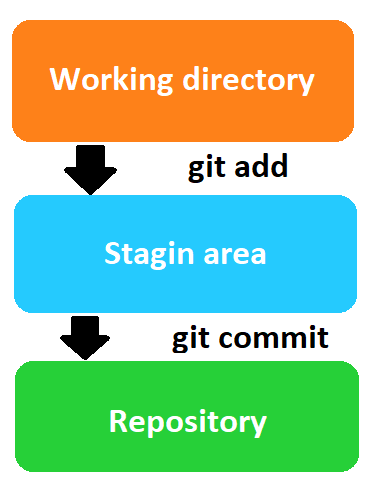

1. Working Directory (Cartella di lavoro, o "Working Tree"): Questa è la cartella sul nostro file system dove effettivamente facciamo le modifiche. Quando modifichiamo un file, le modifiche si troveranno nella nostra Working Directory.

- In pratica, è la vista attuale dei nostri file di progetto, l'area lavoro dove eseguiamo modifiche ai file.
- Quando apriamo un file e ne modifichiamo il contenuto, quelle modifiche sono fatte nella working directory.
- Queste modifiche rimarranno nella working directory fino a quando non verranno aggiunte all'indice (staged) con il comando git add, e poi committate nel repository con il comando git commit.

2. Staging Area (Area di preparazione): Questa è un'area intermedia dove Git tiene traccia delle modifiche che vogliamo includere nel prossimo commit. Quando siamo soddisfatti delle modifiche nella nostra Working Directory, possiamo aggiungere queste modifiche all'area di preparazione usando il comando git add. Questo ci darà un controllo granulare su quali modifiche saranno incluse nel prossimo commit.

3. Repository (.git directory): Comunemente abbreviata in repo, questa è la directory dove Git conserva la storia delle modifiche del progetto. Quando eseguiamo un commit con il comando git commit, Git prende tutte le modifiche che abbiamo aggiunto all'area di staging e le salva nel repository Git come un nuovo commit.

- Un repository Git è l'archivio delle versioni del nostro progetto. Contiene tutta la storia del tuo progetto, inclusi tutti i commit e le modifiche al codice nel tempo.
- Il repository include anche una serie di puntatori ai commit, chiamati rami (branches), tra cui il ramo "master" (o "main", a seconda della configurazione) che è generalmente il ramo principale del progetto.
- Il repository contiene anche informazioni sulle relazioni tra i vari commit, come il genitore di un commit, il che permette a Git di gestire operazioni come il merge e il rebase.

---

# Modifiche elementi in un progetto

In questa lezione vedremo come effettuare le stesse operazioni (quando possibile) sia da terminale che da Visual Studio Code. Partiamo con la creazione di file (e/o cartelle), allo spostamento di elementi nella staging area, ai commit fino ai push online.

## Creazione di file

Iniziamo a creare dei file all'interno della nostra cartella. Ad esempio, creiamo dei file testuali, come questi:

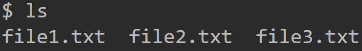

Su VSCode, nella scheda Explorer (la prima icona sul bordo in alto a sinistra),


questi file ci verranno mostrati colorati e con una lettera U alla loro destra.

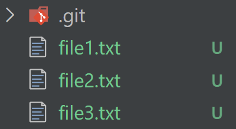

Spostiamoci nella sezione Source Control, dove vedremo solo i tre nuovi file nell'area definita "Changes".

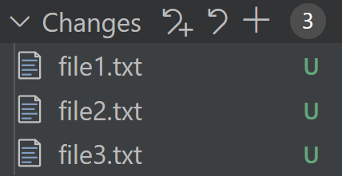

VSCode ci avverte, con diverse etichette poste di fianco ai file, dello stato dei medesimi file. Queste lettere possono aiutarti a capire rapidamente quale sia lo stato di un file nel tuo repository Git.

Ecco cosa significano le lettere più comuni:

- U (Untracked): Questo file non è attualmente tracciato da Git. In altre parole, è un nuovo file che non è mai stato aggiunto al tuo repository.
- A (Added): Questo file è stato aggiunto all'area di preparazione di Git e sarà incluso nel prossimo commit.
- M (Modified): Questo file è tracciato da Git ed è stato modificato, ma le modifiche non sono ancora state aggiunte all'area di preparazione.
- D (Deleted): Questo file è stato eliminato.
- R (Renamed): Questo file è stato rinominato.
- C (Copied): Questo file è stato copiato.

---

## Aggiungere elementi nell'area di Staging

Come anticipato in precedenza, prima di effettuare un commit, dobbiamo inserire dei file nell'area di staging. Spiegheremo approfonditamente dopo che cosa sono i commit e perché sono così importanti. Al momento, ci basta sapere che soltanto i file che abbiamo inserito nell'area di staging potranno poi essere "committati".

### Da terminale

- Per aggiungere un file nell'area di staging sarà necessario scrivere il comando: git add nome_file.ext (ad esempio: git add file1.txt);
-
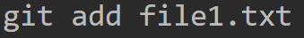

- Possiamo aggiungere tutti i file che abbiamo creato nell'area di staging digitando: git add . (sappiamo che il punto indica l'area in cui ci troviamo, quindi aggiungeremo tutti i file presenti nella repository).

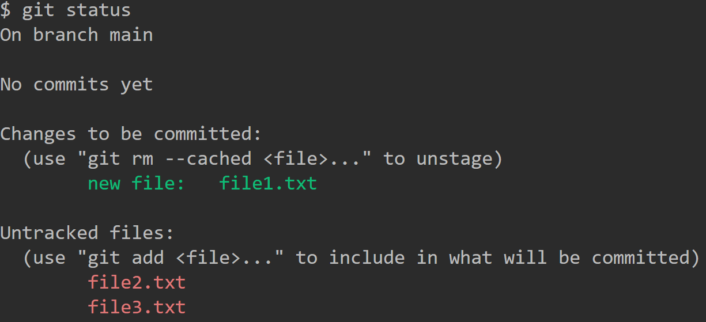

Per controllare quali file abbiamo inserito nell'area di staging, digitiamo il comando git status.

Il comando git status fornisce un riassunto dello stato attuale della repository Git.

Ecco cosa sta dicendo l'output del comando:

- On branch main: Ci troviamo attualmente sul branch main. Questo è il branch su cui stiamo lavorando.
- No commits yet: Non ci sono ancora commit nella nostra repository. Questo significa che non abbiamo ancora salvato alcuna modifica nella nostra repository Git.
- Changes to be committed:: Questa sezione elenca i file che sono stati aggiunti all'area di preparazione di Git, e che saranno inclusi nel prossimo commit che effettueremo. In questo caso, il file file1.txt è stato aggiunto all'area di preparazione.
- new file: file1.txt: Questo indica che file1.txt è un nuovo file che non era precedentemente tracciato da Git, e ora è stato aggiunto all'area di preparazione.
- Untracked files: Questa sezione elenca i file che non sono attualmente tracciati da Git. Questi sono file nuovi o modificati che non sono stati aggiunti all'area di preparazione.
- file2.txt e file3.txt: Questi file non sono attualmente tracciati da Git. Possiamo aggiungerli all'area di preparazione usando il comando git add.

Inoltre:

- La linea (`use "git rm --cached <file>..." to unstage`) è un suggerimento su come rimuovere file dall'area di preparazione (unstage), nel caso abbiamo cambiato idea e non vogliamo includere file1.txt nel prossimo commit.

- La linea (`use "git add <file>..." to include in what will be committed`) è un suggerimento su come aggiungere file non tracciati (come file2.txt e file3.txt) all'area di preparazione, se desiderassimo includerli nel prossimo commit.

### Da Visual Studio Code

Tutti i nuovi file verranno aggiunti automaticamente nell'area Changes. Se passiamo sopra con il mouse sui vari file, compariranno tre icone.


- La prima mostrerà il file nell'editor;
- La seconda annullerà l'azione. In questo caso, il file è stato creato nuovo. Se premessimo questa icona, il file verrebbe cancellato.
- L'ultimo simbolo + invece, aggiungerà il file nell'area di staging. Clicchiamolo.

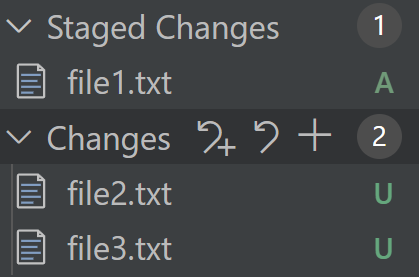

Notiamo com'è cambiata l'interfaccia Git dentro Source Control. Il file1.txt è stato aggiunto all'area di staging (Staged Changes), e lo possiamo notare anche dalla lettera che è cambiata da U ad A, ovvero, added (aggiunto).

Al momento, se effettuassimo un commit, solo il file1.txt verrebbe inserito nel commit, gli altri due, invece no.

PS: notare che ogni elenco (come Changes, Staged Changes ed altri che potremmo trovare) ha anch'esso delle icone. Appena ne abbiamo l'opportunità, esploriamone i funzionamenti.

---

## Rimuovere elementi dall'area di staging

Potremmo decidere che non è più necessario che degli elementi vengano committati. Questo si traduce in rimuoverli dalla staged area e farli tornare nella working area.

### Terminale

- Per rimuovere un file dalla staged area, digitiamo `git reset nome_file.ext`
- Ad esempio: `git reset file1.txt`
- Verifichiamo di nuovo con il `git status`.

### VSCode

Per rimuovere un elemento dalla staged area, basterà cliccare sull'icona del segno meno - nell'elenco Staged Changes.

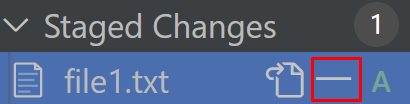

## Eseguire Commit

Dopo aver effettuato una serie di modifiche, possiamo "salvare" i file inseriti nella Stage Area, eseguendo un commit, e salvando il nostro lavoro.

### Terminale

Avendo già dei file nella Stage Area, possiamo committarli tutti scrivendo `git commit` nel terminale. Quando eseguiamo git commit senza specificare un messaggio di commit, Git apre un editor di testo per consentirci di scrivere un messaggio di commit. L'editor specifico che viene aperto dipende dalla configurazione del nostro sistema.

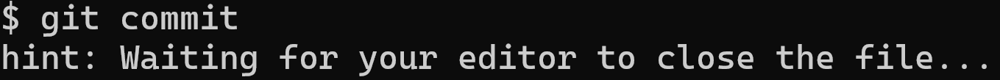

Quando esce il messaggio "Waiting for your editor to close the file...", significa che Git ha aperto l'editor e sta aspettando che inseriamo un messaggio di commit, per poi chiudere l'editor.

Al momento, non addentriamoci in ulteriori configurazioni. Riavviamo il terminale e proseguiamo con la procedura migliore, ovvero immettere un messaggio di commit direttamente dalla riga di comando.

Per farlo, digitiamo il comando

```sh
git commit -m "Messaggio del commit"
```

PS: È possibile inserire una seconda opzione `-m` che sarà la descrizione più accurata del commit. Esempio:

```sh
git commit -m "Titolo del commit" -m "Descrizione molto più accurata del commit, per specificare cosa abbiamo committato.".
```

NB: É buona norma rendere i messaggi di commit descrittivi e significativi. Se ad esempio stiamo aggiungendo un bottone, scriviamo git commit -m "Bottone del form aggiunto", tanto per far un esempio.

Tornando al nostro caso, eravamo rimasti con il file1.txt nella Staging Area. Committiamo.

PS2: Esistono numerose opzioni che si possono dare a questo comando di commit. Sono tutte visibili nel terminale, digitando git help commit, che ci porterà ad una pagina di documentazione ufficiale.

Verifichiamo sempre alla fine con git status per verificare se e quali file non sono stati committati. Infatti, i file che vedremo saranno quelli non ancora committati.

Per vedere la lista di commit invece, digitiamo il comando git log. Verranno mostrati i commit in ordine cronologico decrescente, quindi prima i più recenti.

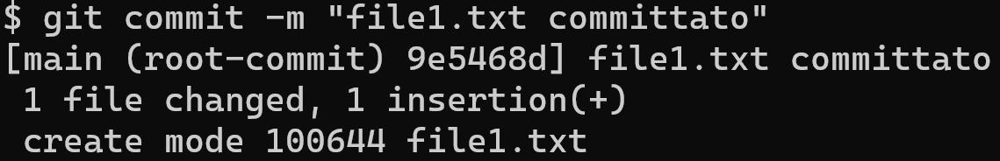

Possiamo vedere che il commit è identificato da una lunga stringa alfanumerica di 40 caratteri, che rappresenta l'ID univoco del commit, ed è definita hash SHA-1. Abbiamo anche l'autore, la data, il titolo e tutte le opzioni che potremmo aver aggiunto al commit, come la descrizione.

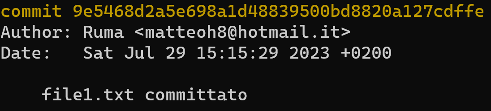

### VSCode

In alternativa, possiamo eseguire il commit dei file che si trovano nell'area Staged Changes semplicemente premendo il bottone. Quando ci sono dei file all'interno dell'area di Staging, il bottone cambierà automaticamente con la scritta "Commit".

Siamo comunque obbligati a scrivere, nella casella di testo, il nome del commit. In conclusione, premiamo il pulsante Commit che VSCode ci mette a disposizione.

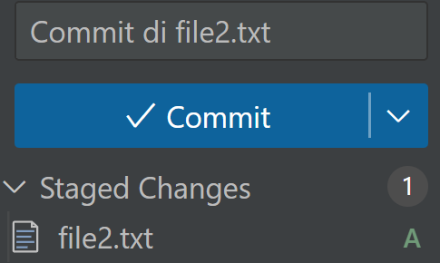

PS: Parleremo approfonditamente dei commit in altre sezioni.

---

## Push in remoto

Una volta eseguito il commit, una best practice è quella di pusharla subito in remoto, in modo che se dovessimo avere dei problemi con la nostra applicazione, abbiamo comunque un backup nel cloud da cui scaricarla (clonarla), e tornare a lavorare su un commit della nostra applicazione con un salvataggio funzionante.

Quando effettuiamo un commit, le modifiche sono salvate solo nella nostra repository locale. Queste modifiche non sono visibili agli altri collaboratori, finché non le inviamo al repository remoto con git push.

### Terminale

Prima di effettuare il push dal terminale, ovvero caricare il commit su un hosting online (ad esempio, GitHub), occorre assicurarti di avere una repository remota.

1. Se la repository online ancora non esiste, dobbiamo prima crearla. Possiamo farlo direttamente dal sito di GitHub. Una volta creata la repository online, collegheremo la repository locale a quella remota utilizzando il comando `git remote add <nome-remoto> <nome-repository-remota>`.

- Ad esempio: `git remote add origin https://github.com/user/repo.git`
	- origin è il nome del remote repository. Questo è un alias che useremo per riferirci a questa specifica repository remota, nei futuri comandi git.
	- [https://github.com/user/repo.git](https://github.com/user/repo.git) è l'URL della nostra repository su GitHub.

2. Una volta collegata la repository remota, possiamo pushare i commit con il comando:

`git push -u <nome-remoto> <branch>`

- Ad esempio: `git push -u origin main`

- Questo comando invierà i commit del branch main locale, al branch main del remote repository origin (GitHub).

- L'opzione `-u` nel comando git push è un'abbreviazione per `--set-upstream`. Quest'opzione viene utilizzata per impostare il branch del repository remoto su cui si desidera eseguire il push dei cambiamenti.

- L'opzione -u serve la prima volta per impostare il tracking tra il branch locale e quello remoto. Questo significa che git saprà in futuro che, quando parliamo del branch main, ci stiamo riferendo al branch main su origin.

- Dopo aver eseguito questo comando la prima volta, per le volte successive basterà semplicemente fare git push per aggiornare il remote repository.

PS: Il nome del branch principale di solito si chiama main o master.

Attenzione: se il branch remoto ha commit che il tuo branch locale non ha (ad esempio, se un collaboratore ha fatto push di commit mentre noi stavamo lavorando), Git ci impedirà di effettuare un push in remoto finché non avremo sincronizzato le modifiche locali con il remoto. Questo può essere fatto con comandi come git pull o git fetch e git merge.

È importante notare che git push modifica il repository remoto. Questo significa che quando facciamo il push delle modifiche, i nostri collaboratori saranno in grado di vederle la prossima volta che sincronizzano il loro repository locale con il remoto.

Inoltre, a seconda della configurazione del repository remoto, potrebbe essere necessario avere i permessi appropriati per fare push delle modifiche. Ad esempio, su piattaforme come GitHub, potrebbe essere necessario essere un collaboratore del progetto, o fare push a un fork del progetto e quindi aprire una pull request. Tutte queste azioni verranno discusse successivamente.

### VSCode

Per pushare su VSCode, dovremmo innanzitutto pushare il branch. Dopo il commit, vedremo che il pulsante sarà diventato come questo:


Questo comando invierà il branch, le modifiche e tutta la repo dal locale a remoto. Nel farlo, creeremo direttamente la repository remota da VSCode. Ci comparirà una finestra in alto in cui potremmo scegliere il nome della repo in remoto su GitHub, se renderla pubblica (visibile, scaricabile ma non editabile da chiunque) o privata (non visibile, scaricabile o editabile).

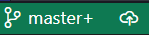

La medesima operazione la troviamo anche in basso, nell'angolo a sinistra dell'IDE.


Queste icone che significano che ci troviamo sul branch master (vedremo in seguito cosa significa). Cliccando sull'icona della nuvoletta con la freccia (uguale a quella del pannello Source Control) caricheremo il branch locale (in questo caso, master) in remoto, ed effettueremo insieme a questa operazione, il primo commit.

#### Opzionale: Commit e Push

Possiamo eseguire le operazioni di Commit & Push contemporaneamente, cliccando sulla freccetta di fianco al bottone Commit, e selezionando l'opzione Commit & Push.

Ricordiamoci di scrivere sempre un messaggio nella casella, in quanto obbligatorio.

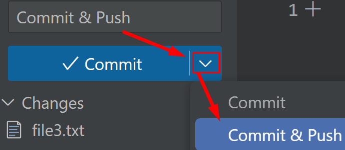

---

# Concatenare comandi da terminale

Possiamo eseguire più comandi Git contemporaneamente digitando i vari comandi da terminale, intervallati da il carattere &&, in modo da concatenare più comandi che verranno eseguiti in sequenza.

Ad esempio:

```sh
git add . && git commit -m "Aggiornamenti" && git push origin master
```

Questo comando eseguirà tre comandi in sequenza:

1. `git add .`  aggiungerà tutti i file modificati nell'area di staging.
2. `git commit -m "Aggiornamenti"` creerà un nuovo commit con il messaggio "Aggiornamenti".
3. `git push origin master` invierà il nuovo commit al branch "master" del repository remoto "origin".

I comandi vengono eseguiti da sinistra a destra, quindi se un comando fallisce, i comandi successivi non verranno eseguiti.