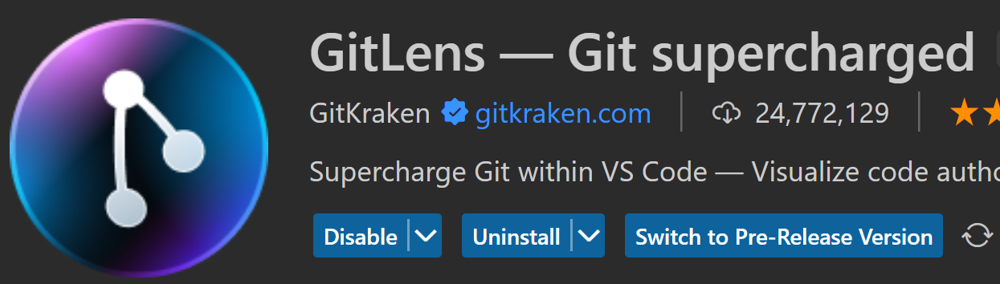

# Commits

Un commit in Git rappresenta una "istantanea" del tuo progetto in un dato momento. Funziona come un punto di salvataggio nel nostro progetto che può essere richiamato in qualsiasi momento.

## Struttura di un commit

Eseguiamo un git log. Come sappiamo, vedremo la cronologia dei nostri commit.

Ogni commit contiene le seguenti informazioni:

- L'hash SHA del commit, un identificativo unico generato da Git.
- L'autore del commit, che include il nome e l'indirizzo email.
- La data e l'ora del commit.
- Il messaggio di commit.

## HEAD - Stato della repository

Ma notiamo il primo commit, ha questa sigla (HEAD ->main, origin/main). Questo rappresenta il punto attuale della nostra repository, e la traccia del branch remoto.

In particolare:

- HEAD: In Git, HEAD è un riferimento simbolico al commit corrente (o in alcuni casi, al commit più recente) della repository. HEAD -> main significa che HEAD punta al branch "main". Se effettuiamo un commit, HEAD si sposterà al nuovo commit. Detto in altri termini, HEAD è un alias per il codice SHA-1 del commit. Quindi, quando vogliamo riferirci a quel determinato commit che ha impostato l'HEAD, invece di utilizzare il codice intero del commit potremmo usare l'alias HEAD.

- main: Questo è il nome del branch locale. I nomi dei branch sono solitamente descrittivi del lavoro che stai facendo. Ad esempio, potremmo avere un branch chiamato "feature/add-new-button" o "bugfix/fix-login-issue". In questo caso, "main" è il nome del branch principale, che è comune nei repository Git.

- origin/main: origin è il nome predefinito che Git dà al nostro repository remoto. Se abbiamo clonato il repository da un altro server, origin rappresenta quell'URL del server. main, dopo origin/ è il nome del branch sul server remoto. Quindi origin/main rappresenta il branch "main" sul nostro server remoto.

Facciamo qualche esempio. Utilizziamo il comando git show che ritorna dei dettagli su uno specifico commit. Non serve per forza dover mettere tutto il codice SHA-1, bastano anche 4-5 cifre:

Se scrivessimo git show HEAD avremmo esattamente lo stesso risultato.

---

## Hash dei commit

In Git, ogni commit è identificato da un codice univoco chiamato hash. L'hash è un codice alfanumerico di 40 caratteri generato tramite l'algoritmo SHA-1. Questo algoritmo prende in input il contenuto del commit (inclusi i metadata come messaggio di commit, autore, data ecc.) e produce un hash che serve come identificatore univoco per quel commit.

La cartella .git/objects memorizza tutti gli oggetti di Git, inclusi i commit. Ogni commit è memorizzato in un file nel quale il nome è l'hash del commit. Questi file sono organizzati in sub-directory basate sui primi due caratteri dell'hash.

Ad esempio, se avessimo un commit con l'hash abc123, avremmo un file chiamato c123 in una sottodirectory chiamata ab all'interno della cartella .git/objects.

Per fare checkout a un commit specifico, usare il comando git checkout seguito dall'hash del commit. Ad esempio: git checkout hash-commit

Non è necessario digitare l'intero hash. Basta inserire abbastanza caratteri per che l'hash sia univoco all'interno del tuo repository. Per esempio, git checkout abc1 può essere sufficiente.

Inoltre, Git è progettato per mantenere un record immutabile della storia del progetto. Questo significa che una volta che un commit è stato fatto, l'hash del commit non cambierà. Se modificassimo il contenuto di un commit, l'hash del commit cambierà per riflettere queste modifiche. Questo rende molto difficile modificare la storia in Git senza che sia evidente che la storia è stata modificata.

Ogni commit in Git ha un riferimento all'hash del commit precedente, creando una catena di commit che rappresenta la storia del tuo progetto. Questo rende molto difficile modificare un commit precedente senza influenzare tutti i commit successivi.

Infine, è importante notare che modificare la storia di Git, in particolare per i commit che sono stati pushati su un repository remoto, può causare problemi per altri sviluppatori che lavorano sullo stesso progetto. Per questo motivo, è generalmente sconsigliato modificare la storia di Git una volta che i commit sono stati pushati su un repository remoto.

---

## Buone pratiche per i commit

Ecco alcune buone pratiche da seguire quando si fanno commit:

- Fare commit piccoli e frequenti piuttosto che grandi commit sporadici. Questo rende più facile identificare e risolvere problemi specifici.
- Scrivere messaggi di commit chiari e descrittivi. Dovrebbero spiegare cosa è stato cambiato e perché.
- Evitare di includere modifiche che non sono correlate tra loro nello stesso commit. Se avessimo modifiche multiple che non sono correlate, dovremmo fare commit separati per ognuna di esse.

### Branch e commit

Una delle caratteristiche più potenti di Git è la sua capacità di gestire branch. Quando facciamo un commit, viene creato nel branch corrente. Questo significa che possiamo lavorare su diverse funzioni o bug in branch separati, senza che le modifiche interferiscano l'una con l'altra.

---

## Commit Graph

Se i singoli commit hanno delle informazioni su una piccola parte del nostro progetto, come facciamo ad avere informazioni su tutto il nostro progetto?

I commit sono organizzati con una struttura ad albero, detta Commit Graph, che in Git è una rappresentazione visuale della storia del nostro progetto. Esso illustra come i vari commit sono collegati tra loro attraverso puntatori parent-child, che permettono di tracciare l'evoluzione del codice nel tempo.

Ogni nodo nel commit graph rappresenta un commit singolo. Ogni commit ha un puntatore al suo commit "genitore" (o ai genitori, nel caso di un merge commit), che è il commit immediatamente precedente nella storia del progetto. Questi puntatori creano una struttura ad albero, che può essere navigata per visualizzare la storia del progetto.

Ecco un semplice esempio di come potrebbe apparire un commit graph:

In questo esempio, A, B, C e D sono commit sulla branch main. E, F, G sono commit su una branch separato chiamato feature. D è il commit genitore di G, F ed E.

Git utilizza il commit graph per determinare quali modifiche sono state fatte in quale ordine. Quando viene effettuato un merge tra due branch, Git può utilizzare il commit graph per determinare quali modifiche devono essere applicate per portare una branch in linea con l'altra.

È importante notare che il commit graph non è necessariamente lineare. Nel caso di merge commit o quando vengono utilizzate funzionalità come rebase, il commit graph può avere molteplici percorsi.

La visualizzazione del commit graph può essere molto utile per capire la storia di un progetto. Molti strumenti di interfaccia grafica per Git (GUI) mostrano il commit graph, e il comando git log può essere utilizzato con varie opzioni (come --graph, --decorate, e --all) per visualizzare il commit graph da linea di comando.

Oltre alle GUI dei Git Client, come Git Kraken o GitHub Desktop, esistono anche molte estensioni per vari IDE. Su VSCode potremmo provare: Git Graph, Git Lens e Git History, giusto per citarne alcune.

# Commits

---

# Operazioni comuni sui commit

In Git, esistono vari comandi che ci permettono di manipolare i commit.

Partiamo da delle premesse: alcuni comandi della seguente lista potrebbero non essere adeguati in tutte le situazioni. Questo perché i comandi sono tanti, e ci sono tante variabili in gioco, come permessi, branch, commit, operazioni di sincronizzazione, e via discorrendo. In caso di risultato inaspettato, cercare sempre online una procedura specifica per il nostro caso.

Detto questo, ecco un breve riassunto di alcuni dei comandi più comuni da terminale.

## Creazione di un commit

- `git add <file> o git add .`: Questo comando aggiunge un file specifico o tutti i file modificati alla nostra "staging area" in preparazione per il commit.
- `git commit -m "messaggio del commit"`: Questo comando crea un nuovo commit con le modifiche che abbiamo precedentemente aggiunto con git add. Il messaggio del commit dovrebbe descrivere brevemente le modifiche che hai effettuato.

## Push dei commit

- `git push origin <branch>`: Questo comando "pusha" (invia) tutti i commit locali sul branch specificato alla nostra repository remota su GitHub.

## Pull dei commit

- `git pull origin <branch>`: Questo comando "pulla" (scarica) tutti i nuovi commit dal repository remoto sul branch specificato al tuo repository locale.

NB: Se abbiamo impostato un branch come predefinito (ad esempio: master) per le operazioni push e pull con il comando `git branch --set-upstream-to=origin/<branch> <branch>`, allora possiamo semplicemente usare `git push` e `git pull` senza specificare `origin/<branch>`. Git capirà automaticamente che vogliamo interagire con `origin/<branch>.`

## Annullamento di un commit

- Se commettessimo un errore, Git ci permette di "annullare" un commit. Questo comando crea un nuovo commit che annulla tutte le modifiche fatte nel commit specificato. Possiamo farlo con il comando git revert, seguito dall'hash SHA del commit da annullare: `git revert <commit>`
- `git reset --hard <commit>`: Questo comando elimina tutti i commit dopo il commit specificato, sia nella repo locale, che nella working directory. Facciamo attenzione con questo comando, poiché rimuove definitivamente queste modifiche.

## Spostamento tra commit

- `git checkout <commit>`: Questo comando ci permette di spostarti su un commit specifico. Le nostre modifiche locali non committate verranno mantenute, ma qualsiasi modifica che faremo da questo punto in poi, verrà applicata sul nuovo branch.

## Pull dei commit

- `git pull` scaricherà gli ultimi commit presenti nel branch corrente.

---

# Tabella dei parametri

Durante i vari comandi per i commit, è possibile utilizzare alcuni parametri per le richieste. Vediamone alcuni.

| **Parametro**              | **Descrizione**                                                                                                                                                                                                                                                        |
| -------------------------- | ---------------------------------------------------------------------------------------------------------------------------------------------------------------------------------------------------------------------------------------------------------------------- |
| `-a` o `--all`             | Include automaticamente nel commit tutti i file già tracciati che sono stati modificati o rimossi. Non include nuovi file (non tracciati).                                                                                                                             |
| `-m` o `--message`         | Permette di specificare il messaggio del commit direttamente da linea di comando, evitando così di aprire l'editor di testo.                                                                                                                                           |
| `--amend`                  | Modifica l'ultimo commit. Questo è utile se vogliamo modificare il messaggio del commit o includere modifiche extra che abbiamo dimenticato nel commit precedente.                                                                                                     |
| `-S` o `--gpg-sign`        | Firma il commit con GPG. Questo è utile per verificare l'autenticità e l'integrità dei commit.                                                                                                                                                                         |
| `-C <commit>`              | Prende il messaggio e l'autore di un altro commit. Utile per creare un commit con le stesse informazioni di un commit esistente.                                                                                                                                       |
| `-p` o `--patch`           | Permette di scegliere interattivamente quali modifiche includere nel commit.                                                                                                                                                                                           |
| `--allow-empty`            | Permette di fare un commit senza cambiamenti. Questo può essere utile per registrare manualmente punti specifici nella storia del progetto.                                                                                                                            |
| `--dry-run`                | Mostra quali file sarebbero stati committati, senza effettivamente fare il commit. Utile per verificare il commit prima di farlo realmente.                                                                                                                            |
| `-u` o `--untracked-files` | Include i file non tracciati. Può essere utilizzato con **no**, **normal** o **all** come argomento.  - **no** mostra solo i file tracciati. - **normal** mostra i file tracciati e non tracciati. - **all** mostra anche i file nel directory non tracciati. |

NB: lavorare con Git può essere complicato, specialmente quando si manipolano i commit. Assicuriamoci di capire cosa fa ciascun comando prima di utilizzarlo, e consideriamo l'utilizzo di un client Git con una interfaccia grafica se preferiamo un approccio più visuale.