# Branch

---

## Cosa sono i branch

Abbiamo visto che i commit sono legati gli uni agli altri da una relazione lineare, e che questi rappresentano i nodi di una catena. Se i commit sono i nodi, i branch sono le catene lineari che uniscono i commit.

---

## Perché i branch

Ci capiterà di dover lavorare in progetti con più sviluppatori. Ognuno di loro sarà al lavoro su un aspetto particolare dell'applicazione: chi deve implementare una nuova funzionalità, chi deve risolvere un bug, chi deve cambiare il tema perché gli è stato fornito dal team di grafica, e così via. A causa del lavoro simultaneo, non è sempre possibile lavorare sulle proprie mansioni, lasciando tutto il team fermo a far nulla.

Un altro esempio molto attinente è sperimentare nuove funzionalità da immettere poi nel sito. Si vorrebbe sperimentare senza dover bloccare il sito, mettendolo in manutenzione temporanea o, ancora peggio, eseguendo le modifiche mentre il sito è online (si dice "in produzione").

Nasce quindi l'esigenza di dover "versionare" il codice, creando di fatto delle copie del sito ma completamente separate per ogni programmatore. Queste copie si chiamano branch (ovvero rami), nei quali i programmatori possono lavorare separatamente, e quando hanno terminato il lavoro, immetteranno le loro modifiche funzionanti (diciamo "mergiare", eseguire il merging) in un altro branch. Le nuove modifiche mergiate saranno disponibili per chiunque abbia accesso a quel branch.

In pratica, i branch in Git rappresentano linee indipendenti di sviluppo. Sono fondamentali per il flusso di lavoro in Git, e permettono a più sviluppatori di lavorare sullo stesso progetto contemporaneamente senza interferire tra loro.

Il branch principale di solito si chiama **master**, o **main**, da cui vengono effettuate le copie dei vari branch.

---

## Creazione del repository in remoto

Prima di qualsiasi operazione con il cloud, assicuriamoci innanzitutto di avere un repository su GitHub nel quale desideriamo caricare il branch. Se non abbiamo ancora creato il repository su GitHub, dovremmo crearlo prima di procedere. Oltre a crearlo manualmente, potremmo farlo anche da terminale.

- Prima di tutto, verificare che il repository Git locale sia configurato correttamente per connettersi al repository su GitHub. Possiamo verificare la configurazione remota eseguendo il seguente comando: `git remote -v`.

- Questo comando visualizzerà l'elenco dei repository remoti configurati nel nostro repository Git locale. Assicuriamoci che ci sia un'origine (origin) configurata correttamente per il repository su GitHub.

- Se non abbiamo ancora configurato una remota per il nostro repository locale, possiamo aggiungerla utilizzando il seguente comando: `git remote add origin <URL_del_repository_GitHub>`. Assicuriamoci di sostituire l'URL effettivo del repository.

- Verifichiamo nuovamente che il repository remoto sia effettivamente visibile in locale con `git remote -v`.

>[!info] Vedere anche [[Computers/Versioning/GitHub/CLI#Creare un repository remoto tramite CLI GitHub|CLI) GitHub

---

## Riassegnare un repository in remoto

Se abbiamo precedentemente già associato il repository locale con un repository remoto sbagliato, possiamo riaggiornarlo in questo modo.

Se il remoto origin esiste già e vogliamo semplicemente cambiare l'URL associato, utilizziamo il comando git remote set-url. Questo comando cambia l'URL del remoto specificato senza dover rimuovere e aggiungere nuovamente il remoto.

- `git remote set-url origin <nuovo-repo-online>`

### Rimuovere e riassegnare repo remoto

Se preferiamo rimuovere completamente il remoto esistente e aggiungerne uno nuovo (anche se di solito il metodo set-url è sufficiente e più diretto), possiamo farlo con i seguenti comandi:

1. Rimuovere il remoto esistente: `git remote remove origin`
2. Aggiungere il nuovo remoto: `git remote add origin <nuovo-repo-online>`
3. Diamo un'ulteriore verifica con `git remote -v`
4. Eseguiamo il push del branch nel nuovo repository: `git push -u origin <nome-branch>`

### Assegnare più repository remoti

Se il progetto necessita di più di un remoto, possiamo anche aggiungerne altri con nomi diversi. Ad esempio, se vogliamo mantenere origin e aggiungere un altro remoto chiamato backup, aggiungiamolo così: `git remote add backup <secondo-repo-remoto>`

---

## Operazioni sui branch

Come per i commit, vediamo quali comandi e quali operazioni possiamo effettuare sui branch.

### Monitorare i branch

Per vedere i branch attivi nel nostro progetto:

### Terminale

Digitiamo git branch. Ci verrà mostrato un elenco di tutti i branch attivi nella nostra repository. Al momento, ne abbiamo soltanto uno, il main.

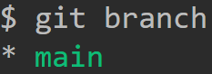

NB: Notare l'asterisco di fianco al branch. Quel carattere indica che questo è il branch corrente.

### VSCode

In VSCode, è possibile vedere tutti i branch, locali e remoti, cliccando sull'icona dei branch nell'angolo in basso a sinistra.
Inoltre, il nome che visualizziamo subito dopo è il nome del branch corrente.

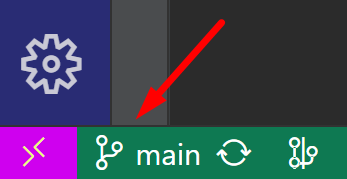

Una volta cliccato sull'icona o sul nome del branch corrente, si aprirà una finestra in alto con la lista di branch ed alcune azioni che possiamo fare.

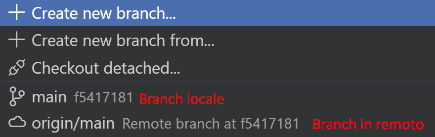

---

## Creazione di un nuovo branch e spostamento tra branch

La creazione di un nuovo branch comporta la copia dell'intera applicazione di quel determinato commit. Impariamo ad utilizzare questa caratteristica a nostro vantaggio.

### Terminale

Per creare un nuovo branch, utilizzare il comando `git branch` seguito dal nome del nuovo branch: `git branch <new-branch>.`

Una volta creato, non verremo spostati automaticamente sul branch appena creato. Quindi, dobbiamo far attenzione a continuare a scrivere codice, perché potremmo star scrivendo nel branch sbagliato.

Creiamo un branch chiamato "nuovo-branch", digitando `git branch nuovo-branch`.

Per spostarsi su un altro branch, utilizza il comando `git checkout`, seguito dal nome del branch dove vogliamo spostarci.

Ad esempio, spostiamoci nel branch che abbiamo appena creato: `git checkout nuovo-branch`.

Facciamo sempre un controllo finale con `git status`. Vediamo che l'asterisco si è spostato sul nuovo-branch, quindi, ci siamo spostati sul nuovo branch.

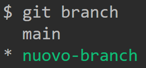

PS: Se desiderassimo creare un nuovo branch e passare ad esso immediatamente, aggiungiamo anche l'opzione **-b**: `git checkout -b <new-branch>`

### VSCode

Utilizziamo la stessa icona per vedere i branch. Possiamo selezionare anche l'opzione "crea nuovo branch da…", e possiamo scegliere da quale branch vogliamo effettuare una copia, per creare il nuovo branch.
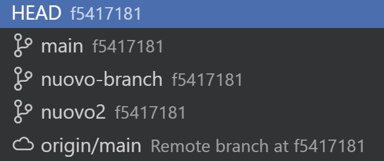

Inoltre, la creazione di un nuovo branch comporterà automaticamente lo spostamento sul nuovo branch.

---

## Pushare il branch

Creato il nuovo branch e spostatoci su di esso, possiamo effettuare il push del branch da locale a remoto, nella nostra repository di GitHub.

### Terminale

Per caricare un branch locale su GitHub bisogna fare il push del nuovo branch locale verso la repository remota chiamata 'origin', utilizzando il comando

```sh
git push --set-upstream origin <nome-branch>
```

Ad esempio:

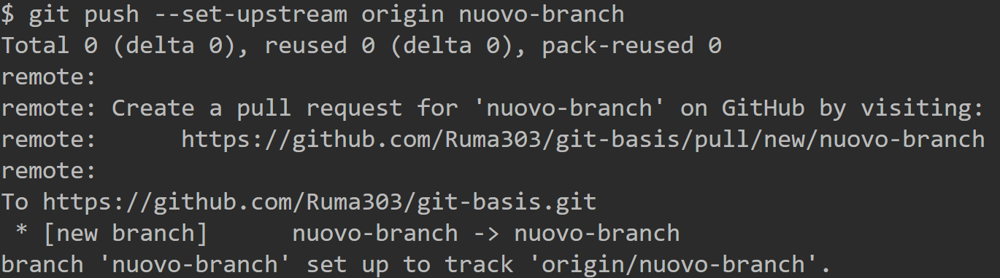

PS: l'opzione `--set-upstream` può essere ridotto in `-u`.

### VSCode

Creato un nuovo branch, assicuriamoci di essere sul branch che vogliamo pushare, e per pusharlo nella repository online possiamo andare o su Source Control, e premere il bottone:


Oppure, possiamo sempre cliccare sull'icona dei branch nell'angolo. Vedremo che è cambiata ed ha la stessa icona del Source Control (la nuvoletta con una freccia in su), il che indica che possiamo caricare il branch online.


---

## Sincronizzare i branch

Sincronizzare i branch significa pushare i propri branch e scaricare contemporaneamente gli altri da remoto. Questa operazione consente di sincronizzare tutte le modifiche della nostra repository sia in locale che in remoto.

### Terminale

Per sincronizzare i branch in remoto scaricando i nuovi in locale, digitare

```sh
git fetch -p
```

NB: Questo comando è fondamentale quando si lavora in team, in quanto altri programmatori potrebbero aver creato nuovi branch. È importante scaricare tutti i branch prima mettersi a lavoro, o si rischia di creare subito dei conflitti.

### VSCode

Sempre nel bordo in basso, la sincronizzazione può essere avviata premendo l'icona delle due frecce circolari.


---

## Eliminare branch

### Terminali

1. Per eliminare un branch locale, utilizzare il comando `git branch -d <nome-branch>`
2. Se si vuol forzare l'eliminazione del branch, utilizza il comando `git branch -D <nome-branch>`
3. Per eliminare un branch remoto, utilizzare il comando `git push origin --delete <nome-branch>`

### VSCode

Nel pannello Source Control, cliccare sull'icona dei tre puntini nel bordo in alto a destra del pannello.

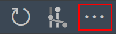

Cliccare poi sulla voce Branch > Delete Branch. Poi, eseguire il push.

---

## Rinominare branch

### Terminale

#### Rinominare branch locali

1. Per rinominare un **branch locale** utilizzare il comando `git branch -m <old-branch> <new-branch>` ma dobbiamo trovarci su un branch differente da quello da rinominare `<old-branch>`.
2. In alternativa, possiamo trovarci già sul branch da rinominare `<old-branch>` ed indicare soltanto il nome del nuovo ramo: `git branch -m <new-branch>`.
3. Possiamo poi utilizzare l'opzione `-M` che indica una forzatura, per essere sicuri di modificare il nome del branch locale. Esempio: `git branch -M <new-branch>`.

#### Rinominare branch remoti

Per rinominare un **branch remoto** dovremmo:
- Rinominare il branch locale: `git branch -m <old-branch> <new-branch>`.
- Inviarlo in remoto: `git push origin <old-branch>` possiamo aggiungere `-u` se dobbiamo anche pushare su questo branch.
- Eliminare il vecchio branch remoto: `git push origin --delete <old-branch>`.

Possiamo anche eseguire altre operazioni consigliate per vedere analizzare i risultati prima di eseguire altre operazioni:
- Aggiorniamo i branch nel repository locale: `git fetch --prune`.
- Controlliamo su quale branch ci troviamo in locale e qual è quello su cui stiamo pushando in remoto `git status`.
- Altro comando per verificare il branch locale attuale: `git branch`.
- E l'elenco dei branch in remoto: `git branch -r`.
- Possiamo ottenere più informazioni su tutti i branch in remoto: `git remote show origin`

### VSCode

Nel pannello Source Control, cliccare sull'icona dei tre puntini nel bordo in alto a destra del pannello.
Cliccare poi sulla voce Branch > Rename Branch. Poi, eseguire il push.

---

## Sostituire branch precedente

Per sostituire un vecchio branch in locale con uno nuovo, seguire questi passaggi:

1. Spostarsi sul branch da rinominare con `git checkout <old-branch>`
2. Rinominare il vecchio branch con `git branch -m <old-branch> <new-branch>`
3. Passare al nuovo branch con `git checkout <new-branch>`
4. Inviare i cambiamenti al repository remoto con `git push -u origin <new-branch>`
5. Eliminare il vecchio branch remoto con `git push -d origin <old-branch>`

---

## Aggiornare branch locale dopo rinomina in remoto

Se abbiamo rinominato un branch predefinito in remoto, sarà necessario rinominarlo anche in locale.

1. Spostarsi sul vecchio branch locale da rinominare con `git checkout <old-branch>`
2. Rinominare il vecchio branch con `git branch -m <old-branch> <new-branch>`
3. Aggiornare la copia locale dei branch remoti `git fetch origin`
4. Impostare il nuovo branch remoto come upstream del branch locale `git branch -u origin/<new-branch> <new-branch>`
5. Impostare il nuovo branch locale come il predefinito per i push `git remote set-head origin -a`

---

## Buone pratiche per i branch

Ecco alcune buone pratiche per l'uso dei branch in Git:

- Mantenere il branch master (o main) sempre pronto per la produzione. Questo significa che dovrebbe contenere solo codice testato e funzionante.
- Creare nuovi branch per ogni nuova funzionalità o bug fix. Questo permette di isolare le modifiche e facilita il test e la revisione del codice.
- Eseguire il merge dei branch frequentemente. Questo aiuta a prevenire conflitti di merge complessi.

---

## Git tag

Il comando git tag è usato per etichettare specifici punti nella storia del codice come importanti.

I principali utilizzi dei tag in Git sono:
- Versioning semantico: i tag possono essere usati per identificare le diverse versioni rilasciate del software, ad esempio v1.0, v1.1 ecc.
- Releases importanti: i tag consentono di marcare i commit che corrispondono a releases importanti del progetto.
- Punti di riferimento: i tag forniscono dei riferimenti facilmente identificabili a specifici punti nella history di un repository.
- Marcatura di stati particolari: i tag possono essere impiegati per segnalare snapshot del codice in particolari stati, come versioni beta, release candidate ecc.

I vantaggi principali dell'uso dei tag in Git sono:

- Permettono di identificare facilmente versioni specifiche del codice da poter ripristinare o confrontare in seguito.
- Rendono più semplice condividere e scaricare determinate versioni tra sviluppatori e team.
- Offrono un sistema di versioning personalizzabile alternativo ai branch.
- Integrano il versioning nel flusso di lavoro Git esistente.

Ecco una breve panoramica di come si utilizza git tag:

- Visualizzare i tag: Per visualizzare i tag esistenti nel repository, digitare `git tag`. I tag verranno elencati in ordine alfabetico.

- Creare un tag leggero: Un tag leggero è molto simile a un ramo che non cambia. È solo un puntatore a un commit specifico. Per creare un tag leggero, eseguire `git tag v1.0-lw`.

- Creare un tag annotato: Un tag annotato è un oggetto di archivio completo con metadati. Contiene l'autore del tag, la data del tag, il messaggio del tag e può essere firmato e verificato con GNU Privacy Guard (GPG). Per creare un tag annotato, eseguire `git tag -a v1.0 -m "messaggio del mio tag"`.

- Push dei tag al repository remoto: Di default, quando eseguiamo git push, i tag non vengono inviati al repository remoto. Occorre eseguire esplicitamente il comando `git push origin [tagname]` per inviare il tag al repository remoto. Per inviare tutti i tag al repository remoto, scrivere `git push origin --tags`.

- Check out a un tag: Per passare a un tag specifico, eseguire `git checkout [tagname]`. Notare che, quando facciamo checkout a un tag, ci trovi in uno stato "HEAD staccato" (detached HEAD) in cui non dovremmo fare sviluppo. Questo significa semplicemente che non stiamo lavorando su una linea di sviluppo designata (cioè un branch).

- Nello stato "detached HEAD", possiamo ancora esplorare il repository, fare modifiche e committare quelle modifiche. Tuttavia, queste modifiche non saranno associate a nessun branch e verranno perse se passiamo a un branch diverso senza prima creare un nuovo branch per le tue modifiche.
- Se vogliamo fare modifiche, dovremmo creare un nuovo branch come `git checkout -b [branchname] [tagname]`.

### Switch

A partire da Git 2.23, è possibile utilizzare il comando `git switch` per spostarsi tra i rami o i tag, che è un po' più intuitivo per i nuovi utenti. Per spostarti su un tag con `git switch`, possiamo digitare:

```sh
git switch --detach nome_del_tag`
```

- **Stato Detached HEAD**

Sia con `git checkout` che con `git switch --detach`, quando ti sposti su un tag, il tuo repository entrerà in uno stato chiamato "detached HEAD". In questo stato, qualsiasi nuovo commit che crei non sarà associato a nessun ramo e potrebbe essere difficile da ritrovare se non crei un nuovo ramo a partire da quel punto.

- Se vuoi iniziare a sviluppare a partire dal tag, potresti voler creare un nuovo ramo subito dopo il checkout:

```bash
git checkout nome_del_tag
git checkout -b nuovo_ramo
```

- Oppure con `git switch`:

```bash
git switch --create nuovo_ramo nome_del_tag
```

Seguendo queste istruzioni, sarai in grado di navigare facilmente tra i vari commit indicando il nome del tag all'interno del tuo repository Git. In generale, l'uso di tag può essere un modo efficace per tenere traccia di versioni specifiche del nostro codice nella repository.

#### Rimuovere un tag

Per rimuovere un tag in Git, usare il comando `git tag` con l'opzione `-d` seguita dal nome del tag che vogliamo eliminare.

```bash
git tag -d nome_del_tag
```

---

## Git log

Con il comando `git log` ci verranno mostrati in ordine di tempo i vari commit che sono stati effettuati sul branch dove ci troviamo. In questa modalità il terminale cambia in maniera interattiva (come un editor vi, vim o bash), e non riusciremo a scrivere i comandi come al solito. Ecco quindi una lista di comandi più utili che possiamo utilizzare in questo caso.

### Detached Head

Quando lavori con Git e ci spostiamo su un tag, entreremo in uno stato chiamato "**detached HEAD**". Questo significa che HEAD, che è essenzialmente un **puntatore** al **commit corrente**, **non è più associato a un ramo**, ma direttamente a un commit specifico (in questo caso, il commit corrispondente al tag `option`).

- In questo stato, siamo in grado di esaminare il codice, fare esperimenti, ecc. È essenzialmente un modo per esplorare la storia del repository, fare test, o recuperare informazioni da vecchi commit.

- Quando siamo in detached HEAD, possiamo fare tutto quello che normalmente faremmo in un ramo, inclusa la modifica di file e il commit. Tuttavia, se faremo dei commit mentre siamo in questo stato, questi commit non saranno associati a un ramo e potrebbero essere difficili da recuperare una volta che cambiamo contesto, a meno che non creiamo un nuovo ramo da quello stato.

#### git show

Il comando `git show nome_tag` è molto utile per visualizzare informazioni su un tag specifico, incluso il commit a cui il tag è attaccato, il messaggio di commit, e le modifiche effettuate in quel commit. Ecco un esempio di comando:

```sh
git show nome_tag
```

### Ritornare a uno Stato Attaccato (Attached)

Per ritornare a uno stato attaccato, cioè per riattaccare HEAD a un ramo, basterà semplicemente fare checkout di un ramo, per esempio:

```sh
git checkout nome_ramo
```

#### Riattaccare HEAD Usando l'ID del Commit

Se vogliamo specificamente fare checkout dell'ultimo commit a cui eravamo attaccato prima di passare in detached HEAD, bisogna conoscere l'ID del commit o avere un riferimento a esso. Se non ricordiamo l'ID del commit, possiamo cercarlo nel log di Git:

```sh
git log --oneline
```

Troviamo l'ID del commit a cui vogliamo tornare e poi usiamo:

```sh
git checkout id_del_commit
```

---

# Merge

Il merge è un aspetto potente di Git che consente di combinare il lavoro svolto su branch separati. Sebbene possa essere un po' complicato, soprattutto quando si verificano conflitti di merge, una volta compreso, si rivela uno strumento indispensabile per la gestione efficace dei progetti di sviluppo software. Ricorda sempre di fare merge in modo responsabile e di risolvere attentamente i conflitti per mantenere la base di codice pulita e funzionante.

L'operazione di merge è uno dei concetti fondamentali in qualsiasi sistema di controllo versione, e Git non fa eccezione. Un merge è l'atto di combinare le modifiche effettuate su due branch distinti. Questo consente di unire le modifiche fatte in un branch (come nuove funzionalità o correzioni di bug) nel branch principale.

---

## Tipi di Merge

Ci sono due tipi principali di merge in Git: fast-forward e three-way.

### Fast-Forward Merge

Un branch in Git è essenzialmente un puntatore a un commit specifico, piuttosto che una sequenza di commit. Quando ci sono commit su più branch, l'ultimo commit su ogni branch rappresenta in pratica la "punta" di quel branch.

Un merge fast-forward avviene quando la linea di commit tra il branch corrente e il branch che stiamo cercando di unire è ininterrotta. In altre parole, non ci sono stati nuovi commit sul branch corrente dal momento in cui è stato creato il branch che stiamo cercando di unire.

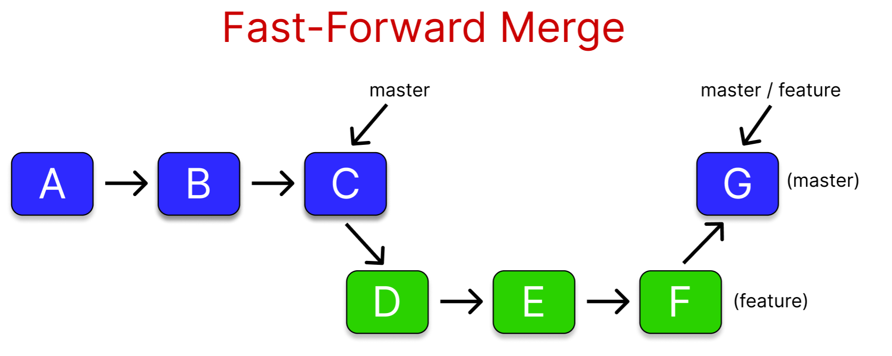

In questo scenario, Git semplicemente "sposta in avanti" il puntatore del branch corrente fino all'ultimo commit del branch che stiamo cercando di unire. Questo significa che invece di creare un nuovo commit per il merge, Git semplicemente sposta il puntatore del branch, creando così un merge fast-forward.

---

### Three-Way Merge

Un "merge a tre vie" è un processo più complesso che avviene quando la storia dei commit dei due branch ha divergenze. In altre parole, quando entrambi i branch hanno dei commit che non sono in linea.

In questo caso, Git ritorna al più recente commit in comune tra i due branch e analizza le modifiche effettuate su ciascuno di essi da quel punto in poi. Successivamente, tenta di unire le modifiche.

Tuttavia, non sempre è possibile unire automaticamente le modifiche. Quando ci sono delle modifiche che si sovrappongono o sono in conflitto tra i due branch, Git non è in grado di decidere quale versione mantenere. Questo genera i cosiddetti "conflitti".

In tali situazioni, è necessario intervenire manualmente per risolvere i conflitti. Si deve decidere quale versione del codice mantenere e quale scartare. Questo può richiedere una buona comprensione del codice e del contesto in cui le modifiche sono state apportate.

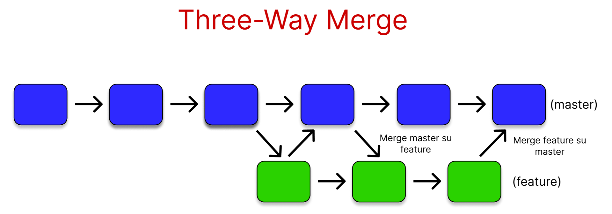

Questa situazione accade specie se lavoriamo in team con altri sviluppatori. Capita che a fine turno di dover mergiare il codice su un altro branch, ad esempio sul master, ma questa operazione fatta da tutti, comporterà dei conflitti. Uno dei metodi di ridurre i conflitti successivamente è effettuare il merging inverso. Risolti i conflitti, passeremo nel master e mergeremo le modifiche del master sul branch nel quale stiamo lavorando, in modo da partire a lavorare senza conflitti.

---

## Merge in Git

Per eseguire il merge di un branch su un altro, prima di tutto, assicuriamoci di essere sul branch in cui desideriamo unire le modifiche. Ad esempio, se si vuol unire le modifiche dal branch feature al branch master, bisogna prima spostarsi sul branch master.

### Senza conflitti: Fast-Forward Merge

#### Terminale

1. Spostiamoci sul branch in cui verranno fuse le modifiche: `git checkout master`
2. Eseguire il merge, indicando da quale branch vogliamo prendere il suo commit: `git merge feature-branch`

Se non ci sono conflitti tra i due branch, Git eseguirà automaticamente il merge e creerà un nuovo commit nel branch master che includerà le modifiche dal branch feature.

In questo esempio, notiamo che Git ci ha specificato che il merge del branch nuovo2 avvenuto sul main, è di tipo Fast-forward, e che sono state fuse le modifiche effettuate nel file2.txt

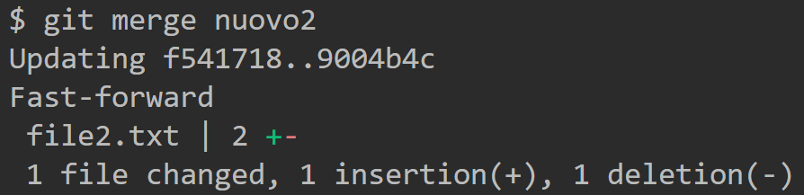

Digitando `git log`, possiamo vedere che alcune modifiche degli altri branch, specie quelli in remoto (origin), non sono stati ancora pushati.

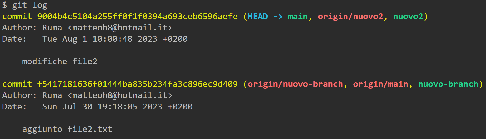

#### VSCode
1. Spostarsi sul branch che verrà mergiato.
2. Andare nel pannello Source Control.
3. Nei tre pallini in alto a destra del pannello, scegliere Branch > Merge > cliccare sul branch da cui prendere il commit da mergiare su quello in cui ci troviamo.

---

## Con conflitti: Three-Way Merge

Se ci sono delle modifiche conflittuali, cioè se le stesse parti di uno o più file sono state modificate in modi diversi nei due branch, Git non sarà in grado di eseguire il merge automaticamente e ci avviserà dei conflitti.

### Creazione di un conflitto

Eseguiamo delle modifiche anche su un altro branch, sempre nel file2.txt. Torniamo sul branch main e mergiamo il branch su cui abbiamo appena effettuato le modifiche (che si chiama nuovo-branch). Adesso, avremo dei conflitti, in quanto abbiamo effettuato il merging di due branch in cui è stato modificato lo stesso file.

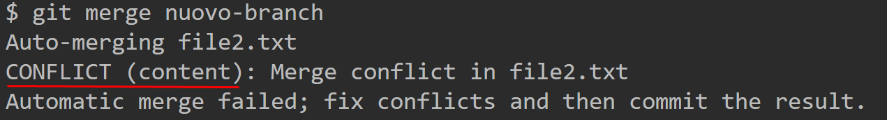

Possiamo utilizzare questo comando per avere una rappresentazione visuale migliore dei conflitti:

```sh
git log --graph --abbrev-commit --pretty=oneline --all
```

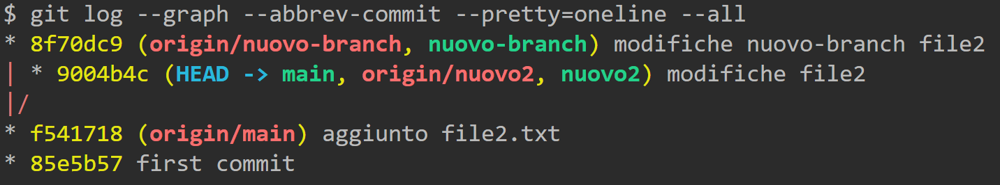

Possiamo notare che dal commit `f5` viene creato un nuovo branch. Quando abbiamo concluso, digitiamo `:q` per uscire.

### Individuare i conflitti

Per risolvere questo problema di conflitti, dobbiamo prima di tutto individuare i file con conflitti. Git mostrerà quali file hanno conflitti quando tenti di fare il merge. In alternativa, utilizzare il comando `git status` per vedere quali file hanno conflitti.

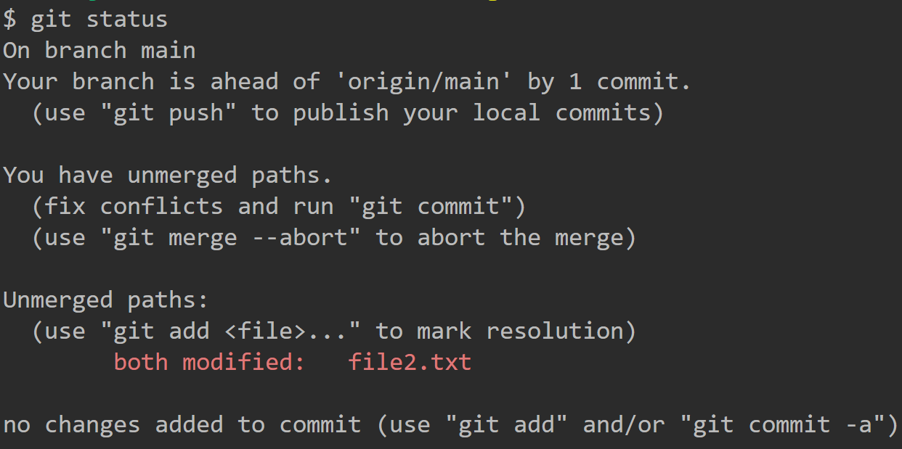

### Risolvere i conflitti

Nel nostro editor VSCode vedremo qualcosa di simile. Questa vista può anche essere visualizzata nel terminale se si utilizzano editor da terminale come nano, vim o ecmas.

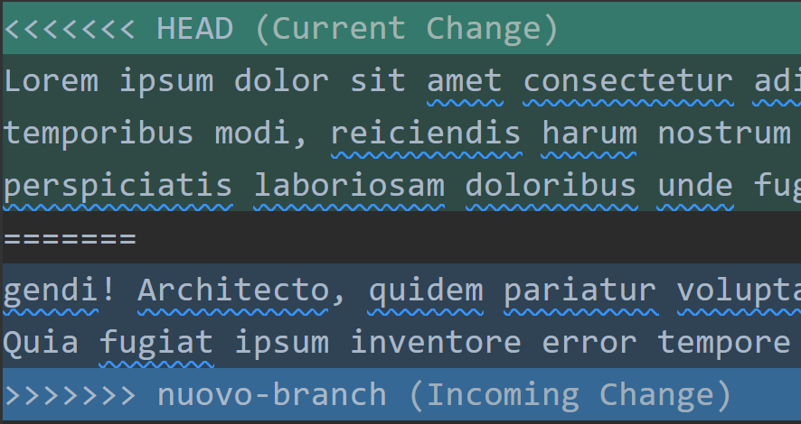

La parte tra `<<<<<<< HEAD` e `=======` è la versione del branch attuale, e la parte tra `=======` e `>>>>>>> nome_del_branch` è la versione del branch che siamo cercando di unire. Dobbiamo decidere quale versione mantenere, o se combinare entrambe in qualche modo, modificando a mano il codice nell'editor.

VSCode ci mette a disposizione una vista appositamente creata per risolvere i conflitti. Clicchiamo su questo bottone:


Visualizzeremo 3 schermate: Incoming è il branch secondario che deve collassare sul primario, Current è quello su cui vogliamo far mergiare l'incoming, Result sarà il commit risultato delle nostre scelte.

Dovremmo modificare la schermata Result, in quanto le altre due superiori forniscono solo la vista del codice scritto nei branch in conflitto.

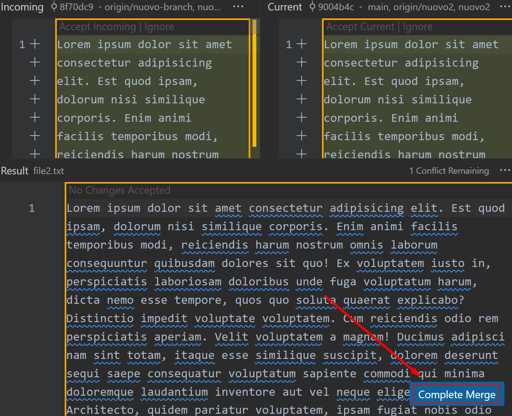

Una volta deciso quale codice tenere e quale scartare, clicchiamo sul pulsante Complete Merge.

### Pushare il commit finale

Una volta risolto ogni conflitto in un file, aggiungere quel file all'area di staging con git add.

Ad esempio:

```sh
git add nome_del_file
```

Ripetere i passaggi precedenti per ogni file con conflitti.

Infine, una volta risolti tutti i conflitti e aggiunti i file all'area di staging, eseguire un commit con `git commit`. E magari pushare direttamente il commit che ha risolto il conflitto.

Rieseguendo il comando git log grafico, vedremo che i merge sono stati uniti in un unico commit.

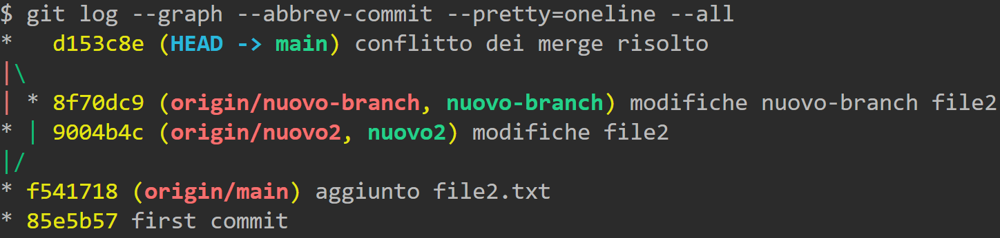

Per risolvere il conflitto, utilizziamo il comando:

```sh
git merge 3way_branch
```

---

# Rebase

Git Rebase è uno strumento che permette di modificare la base di un ramo da una commit a un'altra. In altre parole, permette di prendere le modifiche che sono state apportate in un ramo e di applicarle a un altro ramo. Questo può essere utile per mantenere la storia del tuo progetto pulita e lineare.

Non è un grosso problema se lavoriamo da soli, ma se siamo in un team dove qualche sviluppatore si sta basando su dei commit che verranno modificati, c'è da fare attenzione a non rovinargli il lavoro.

---

## Esempio di uso di Rebase

Supponiamo di avere due rami, master e feature. Abbiamo fatto qualche commit nel ramo feature mentre altri sviluppatori hanno fatto dei commit nel ramo master. Ora, vogliamo aggiornare il nostro ramo feature con le ultime modifiche del ramo master, senza perdere le modifiche di alcun branch.

Ecco come effettuare il rebase:

1. Assicuriamoci di essere nel ramo che da ri-basare: `git checkout [branch da ri-basare]`, ad esempio: `git checkout feature`;

2. Usare il comando git rebase seguito dal nome del ramo sul quale vogliamo ri-basare le modifiche: `git rebase [branch da cui ri-basare]`, ad esempio, `git rebase master`. Questo sposterà tutti i commit fatti nel ramo feature, in modo che siano "basati" sull'ultimo commit nel ramo master. In altre parole, è come se avessimo creato il ramo feature dall'ultimo commit nel ramo master, anche se in realtà lo abbiamo creato molto prima.

3. Potremmo dover risolvere eventuali conflitti di merge. Se Git non riesce a ri-basare automaticamente alcuni commit, ci fermerà e chiederà di risolvere quei conflitti manualmente. Dopo aver risolti i conflitti, possiamo aggiungere i file risolti con `git add` e continuare il rebase con `git rebase --continue`.

4. Per annullare il rebase in qualsiasi momento: `git rebase --abort`.

---

## I rischi del Rebase

Mentre il rebase può essere un potente strumento per mantenere pulita la storia dei commit, ha anche alcuni rischi:

- Riscrive la storia: Il rebase modifica effettivamente la storia della repository, spostando o modificando i commit. Questo può essere problematico se altri sviluppatori stanno lavorando sullo stesso ramo, perché la storia del loro ramo non sarà allineata con la nostra.

- Perdita di contesto: Poiché il rebase sposta i commit, potremmo perdere il contesto in cui sono stati fatti originalmente. Questo può rendere più difficile comprendere perché una certa modifica è stata fatta.

- Conflitti di merge: Quando ri-basiamo un ramo, potremmo dover risolvere gli stessi conflitti di merge più volte, perché Git prova a ri-applicarli ciascun commit individualmente.

In generale, dovremmo evitare di usare git rebase su rami che sono usati da altri sviluppatori. Il rebase è più adatto per pulire la storia di commit locale prima di condividerla con altri.