# Collaborare con altri programmatori

Collaborare con altri sviluppatori utilizzando Git e GitHub può essere un processo strutturato in vari modi, ma di seguito è presentato un processo comune che molti team di sviluppo seguono.

Git ha di default la possibilità di lavorare con una o più remote. Questo significa che possiamo lavorare ad una sola repository ma da più macchine e più account git based client, ad esempio GitHub.

---

## Creazione repository online

Il primo passo per la collaborazione è la creazione di un repository su GitHub. Potremmo crearne una locale e pusharla da VSCode, come abbiamo fatto fino ad ora, ma questa volta lo facciamo dal sito. Questo può essere fatto cliccando sul pulsante "New" sul nostro profilo GitHub. Creiamo la repository (dev'essere pubblica o gli altri programmatori non saranno in grado di clonarla) dando un nome alla rotta.

Dopo la creazione, GitHub ci manda in una pagina con delle istruzioni da seguire, come associare una repository locale se l'abbiamo per sincronizzarla con quella appena creata, oppure importare da un'altra repo esistente online. Possiamo sia non fare nient'altro, oppure aggiungere una repository locale a questa online appena creata.

- Digitiamo `git remote add origin link-repo-online.git` per quale repository online andremo a sincronizzare con quella in locale.
- Eseguiamo il push della repository con `git push -u origin master`

Dopo il push, torniamo nella pagina della repository e vedremo che le istruzioni sono sparite. Al loro posto sono comparsi i file della repository locale che sono stati caricati su GitHub.

Possiamo vedere tutti i comandi remote che abbiamo effettuato con `git remote -v`

---

## Invitare altri collaboratori

È possibile invitare uno sviluppatore a collaborare ad una nostra repository. Andiamo su GitHub, nelle impostazioni della repository da condividere. Accediamo all'area "**Collaborators**". Clicchiamo sul pulsante "**Add people**", dove potremmo ricercare collaboratori tramite username, nome intero ed email.

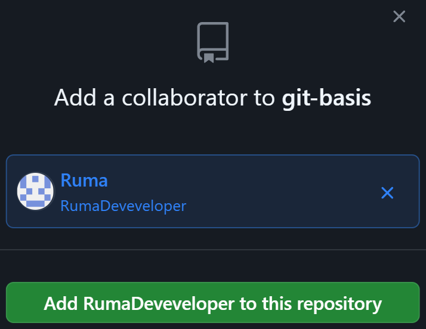

Invitato il collaboratore, Github invierà un'email e anche una notifica, visibile nell'area di notifiche in alto a destra.


Arriverà quindi una notifica.


Da uno di questi inviti potrà accettare di collaborare, e proseguirà alla clonazione della nostra repo.


### Iniziare col piede giusto

Un buon consiglio è di inizializzare la repository in modo impeccabile: scaricare e installare tutte le librerie e i plugin necessari, definire tutte le configurazioni di base ed effettuare il primo commit in modo che, l'applicazione di base, sia perfettamente funzionante.

Possibilmente, definire anche una piccola guida nel file README.md o file testuale simile, per istruire i collaboratori ad utilizzare al meglio i comandi e i passaggi da seguire per il nostro progetto.

In questo modo, quando i collaboratori scaricano la nostra repository, non dovranno ripetere tutti questi passaggi iniziali, riducendo così il rischio di perdere tempo o di incappare in bug. Questo approccio consente a tutti di iniziare a lavorare in modo più efficiente e sicuro.

Adesso sarà il turno del nostro collaboratore.

---

## Il collaboratore

Questa sezione è dedicata alle azioni che il collaboratore dovrà eseguire per lavorare con una repository già creata da un altro sviluppatore. Inizieremo con il clonare una repository, in modo da poter lavorare tutti sullo stesso progetto.

---

### Clonazione repository

Una volta creato il repository, gli altri sviluppatori possono clonarlo sul loro computer locale. Esistono vari modi per farlo. Entriamo nella pagina della repository appena creata, e notiamo questo pulsante evidenziato "**Code**".

Verrà mostrato un menu a tendina con varie opzioni. Non ci soffermiamo troppo su ognuna di loro. Quel che ci interessa è copiare il link della repository. Questo link sarà identico all'URL della pagina web della repository, ma avrà l'estensione finale `.git`

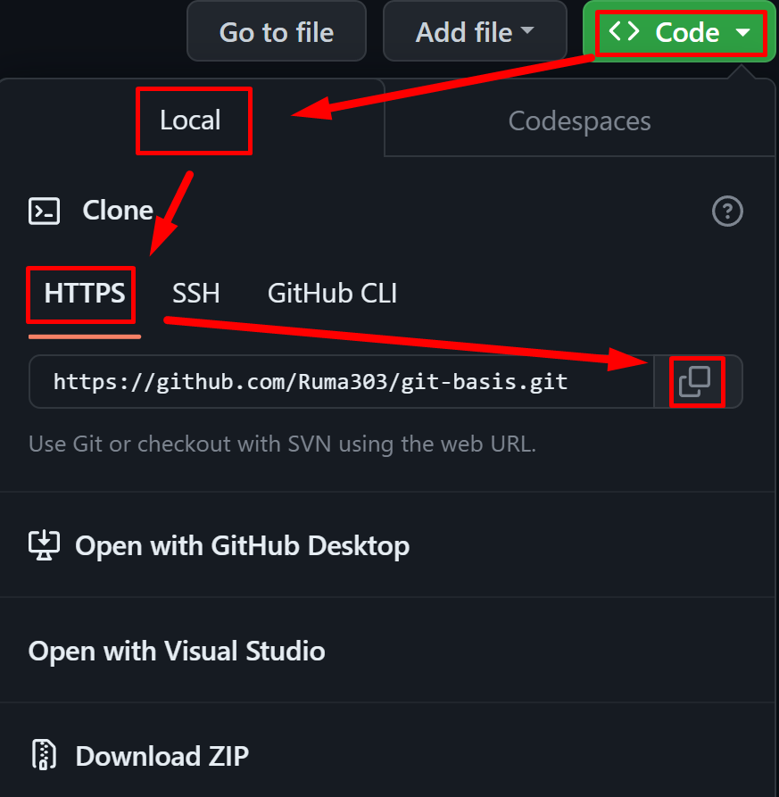

Il collaboratore adesso potrà effettuare la clonazione.
1. Il collaboratore si posiziona con il terminale nella cartella della propria macchina dove desidera scaricare la repository.
2. Nel terminale dovrà digitare il comando `git clone`, seguito dal link di GitHub con l'estensione .git finale.

Ad esempio:

```sh
git clone https://github.com/username/repository.git
```

Questo comando effettuerà il download di tutta la repository da remoto alla macchina del collaboratore. In base al proprio OS, o sistema di download utilizzato, potrebbe esser richiesti password o autorizzazioni varie.

---

## Post clonazione

Dopo la clonazione di un progetto, in base alle tecnologie utilizzate nella repository, potrebbe essere necessario dover installare le dipendenze delle librerie ed effettuare ulteriori configurazioni.

Ad esempio, per installare le dipendenze JavaScript normalmente si utilizzano gestori di pacchetti come NPM o Yarn, e per installare le dipendenze si può utilizzare il comando `npm install`. Generalmente, tutte le operazioni di configurazione dovrebbero esser state scritte dallo sviluppatore che ha creato la repository, all'interno del file README.md, che di default verrà creato durante l'inizializzazione di una repository Git.

Sarà proprio GIT a creare un file README.md con una guida standard, basandosi sulle tecnologie che utilizza la repository. Per esempio, se creiamo una repository con un framework basato su JavaScript, troveremo una guida che ci avvertirà di installare tutte le dipendenze con `npm install`, ed avviare il server di sviluppo con `npm run dev`.

---

## Pull e Fetch

I comandi `git fetch` e `git pull` sono entrambi utilizzati per aggiornare il repository locale con le ultime modifiche da un repository remoto. É buona norma assicurarsi di avere sempre la versione più recente del codice.

### git fetch

Il comando git fetch scarica tutte le modifiche recenti dal repository remoto alla repository locale, ma non le unisce automaticamente con il branch di lavoro corrente. In altre parole, git fetch permette di vedere cosa è cambiato nel repository remoto, ma non applica effettivamente queste modifiche al nostro codice di lavoro.

Questo può essere utile quando vogliamo vedere cosa hanno fatto gli altri sul progetto, senza mischiare immediatamente le loro modifiche con il tuo lavoro. Dopo aver eseguito git fetch, possiamo esaminare i commit scaricati con comandi come `git log` o `git diff` prima di decidere se unirli con il tuo branch di lavoro.

L'opzione `-p` o `--prune` con `git fetch -p` dice a Git di rimuovere qualsiasi riferimento remoto o "tracking branch" nel repository locale che non esiste più nel repository remoto.

NB: Il comando `git fetch -p` scaricherà le informazioni sui nuovi branch dal repository remoto al repository locale. Dopo aver eseguito `git fetch -p`, vedremo i nuovi branch come branch remoti nel repository locale. Possiamo visualizzare questi branch con il comando `git branch -r`. Se volessimo lavorare su uno di questi nuovi branch, dovremmo creare un nuovo branch locale che tracci il branch remoto.

### git pull

Il comando `git pull` è in realtà una combinazione di `git fetch` seguito da `git merge`. Questo significa che git pull scaricherà le modifiche recenti dal repository remoto (come git fetch) e poi tenterà di unirle automaticamente con il branch di lavoro corrente.

Quindi, se eseguiamo `git pull origin main`, Git si sincronizzerà con il repository remoto, scaricherà le modifiche più recenti dal branch main e poi tenterà di unirle automaticamente con il branch di lavoro corrente nel repository locale.

In pratica, git pull è più conveniente se sappiamo che vogliamo immediatamente incorporare le ultime modifiche nel tuo lavoro. Tuttavia, se volessimo più controllo sul processo di integrazione, potremmo voler usare git fetch e poi unire manualmente le modifiche quando siamo pronti.

NB: Il comando git pull non scaricherà automaticamente i nuovi branch. Ciò perché git pull è una combinazione di git fetch e git merge, e il comando git merge opera su un singolo branch alla volta. Di conseguenza, git pull scaricherà solo le modifiche dal branch correntemente tracciato e cercherà di unirle automaticamente con il branch di lavoro locale.

Se volessimo scaricare le modifiche da un nuovo branch con git pull, dovremmo prima configurare il repository locale per tracciare quel branch. Possiamo farlo con il comando `git checkout -b <new-branch> origin/<new-branch>`, che crea un nuovo branch locale, lo configura per tracciare il branch remoto corrispondente, e poi passa al nuovo branch. Da qui in poi si potranno effettuare commit, push, pull, merge ed altre operazioni tra collaboratori, utilizzando Git.

---

# Fork

Esistono due modi di utilizzare una repository di un altro sviluppatore, eseguire una clonazione oppure un fork. Queste sono due operazioni differenti in Git e GitHub. Vediamo le differenze.

## Clonare una repository

Quando cloniamo una repository, stiamo creando una copia locale di quella repository sul tuo computer. Questa copia include tutti i file del progetto e la storia dei commit. Possiamo fare modifiche a questa copia locale, fare commit delle nostre modifiche, e poi fare push di queste modifiche alla repository originale (se hai i permessi per farlo), o a una tua repository remota.

---

## Fare il fork di una repository

D'altra parte, fare il fork di una repository è un'operazione specifica di GitHub (o altri servizi Git based Online). Quando eseguiamo il fork di una repository, stiamo creando una copia di quella repository sotto il nostro account GitHub. Questa nuova repository è collegata alla repository originale come "repository padre". Possiamo fare modifiche alla nostra fork, fare commit e push.

Se cerchiamo online e troviamo un progetto open source interessante, possiamo forkarlo (copiarlo). Su GitHub abbiamo questo pulsante per eseguire il fork di un progetto:


---

## Pull Requests

Il fork è un modo comune per contribuire a progetti open source. Permette a chiunque di fare modifiche a una repository senza aver bisogno di permessi di accesso alla repository originale. Questo è uno dei meccanismi dei progetti open source, in cui uno sviluppatore esegue il fork di una repository, effettua delle modifiche, infine suggerisce le modifiche da aggiungere al progetto iniziale eseguendo una Pull Request.

Una Pull Request (PR) è un termine utilizzato nelle piattaforme di gestione di codice sorgente, come GitHub, GitLab o Bitbucket, che si riferisce al processo di richiedere l'integrazione delle modifiche apportate a un ramo di sviluppo (branch) in un altro ramo, solitamente il ramo principale (master o main).

La pull request è quindi un modo per proporre le modifiche ad un branch su una repository di altri sviluppatori. I proprietari della repository originale possono quindi rivedere il codice, fare commenti e suggerire modifiche. Una volta che tutti sono d'accordo sulle modifiche, la pull request può essere "mergiata", applicando così le modifiche al branch principale, oppure rifiutare le modifiche.

In breve, una Pull Request è un meccanismo per:

1. Proporre modifiche al codice sorgente.
2. Ottenere feedback e collaborazione sugli aggiornamenti proposti.
3. Revisionare e testare le modifiche prima dell'integrazione nel ramo principale.

---

## Creare un Pull Request

Ecco un esempio di flusso di lavoro tipico per una Pull Request:

1. Creare un nuovo ramo di sviluppo dal ramo principale.
2. Apportare le modifiche necessarie al codice nel nuovo ramo.
3. Eseguire un commit delle modifiche e fare push del ramo sul repository remoto.
4. Creare una Pull Request per richiedere l'integrazione delle modifiche nel ramo principale.
5. Discutere e revisionare le modifiche con altri collaboratori.
6. Apportare eventuali aggiustamenti al codice e aggiornare la PR.
7. Una volta che le modifiche sono state approvate, unire la PR nel ramo principale.

---

## Pull request da GitHub

Un altro metodo consiste nel modificare file o crearne di nuovi direttamente dal proprio account GitHub. Scegliamo il branch dal quale partire, aggiungiamo un nuovo file dal pulsante:


Creiamo il nuovo file con del codice.

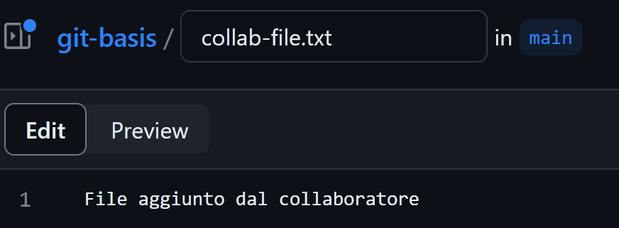

Per effettuare una nuova Pull Request dobbiamo creare un nuovo branch, in quanto pushare direttamente sul branch da cui abbiamo creato il nuovo file potrebbe esserci impedito da misure di sicurezza. In ogni caso, il codice andrebbe prima controllato dal proprietario della repository originale, o un suo responsabile, che controlla il codice della pull request in arrivo.

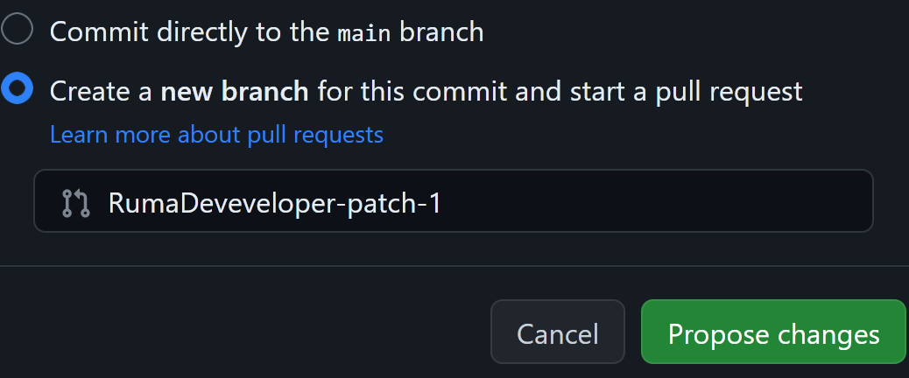

Effettuate le modifiche, possiamo effettuare la Pull request. Clicchiamo sul pulsante "**Compare & pull request**".

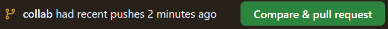

Possiamo dare un titolo alla pull request, una descrizione del contenuto, e nel bottone in basso possiamo anche scegliere l'opzione di salvare in bozza la pull request, per effettuarla in un secondo momento.

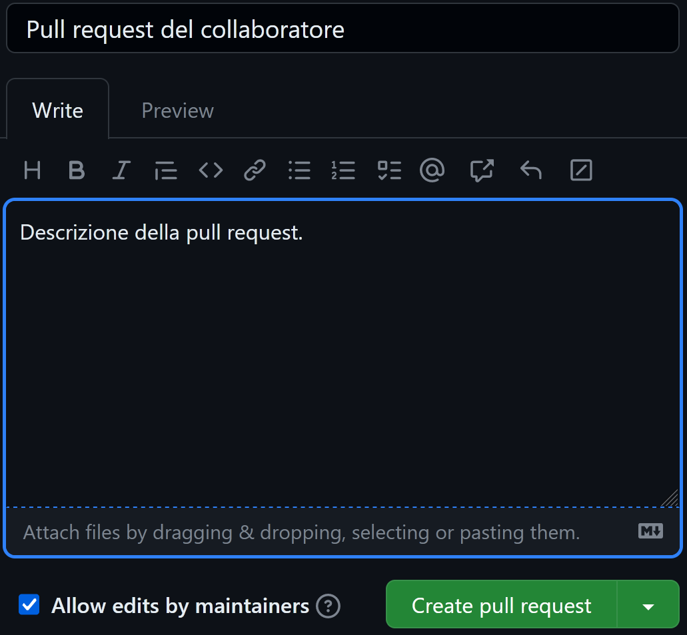

Torniamo nell'account del proprietario della repository. Nella propria repository si troverà una notifica di pull request nell'apposita area.


Dove potrà visualizzare in dettaglio la pull request del collaboratore. Clicchiamo sul nome della pull request.

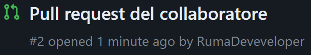

Possiamo verificare il contenuto della pull request dalle schede in alto.

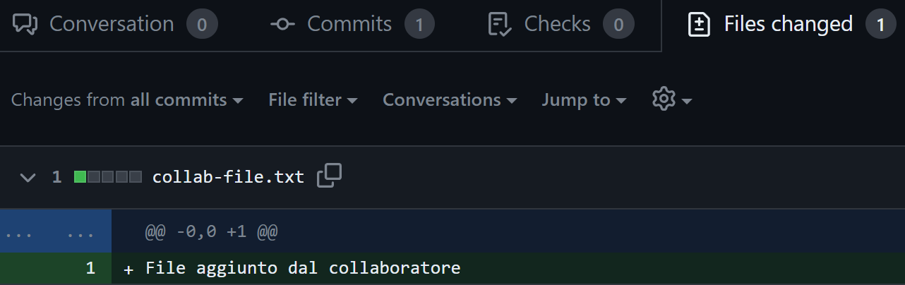

In fondo alla pagina possiamo commentare chiedendo ulteriori informazioni in merito alla pull request:

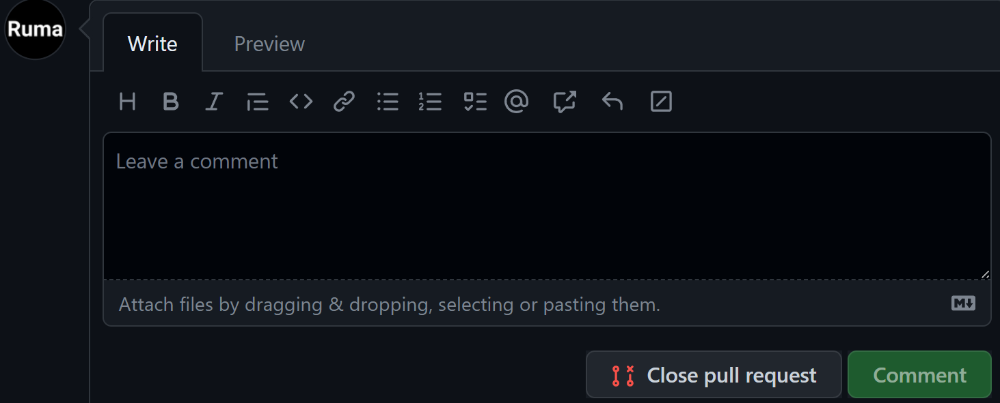

- Se non vogliamo integrare le modifiche, chiuderemo la pull request dall'apposito pulsante;
- Se vogliamo integrare il codice nel nostro progetto, effettuiamo il merge dei branch:

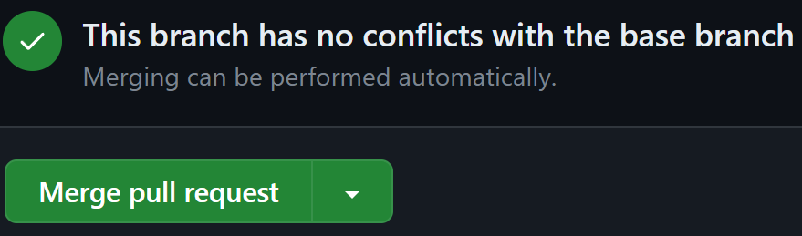

Una volta effettuato il merge, torniamo nella repository originale e vedremo le modifiche aggiunte al ramo.

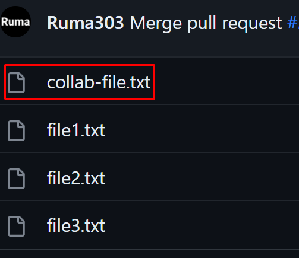