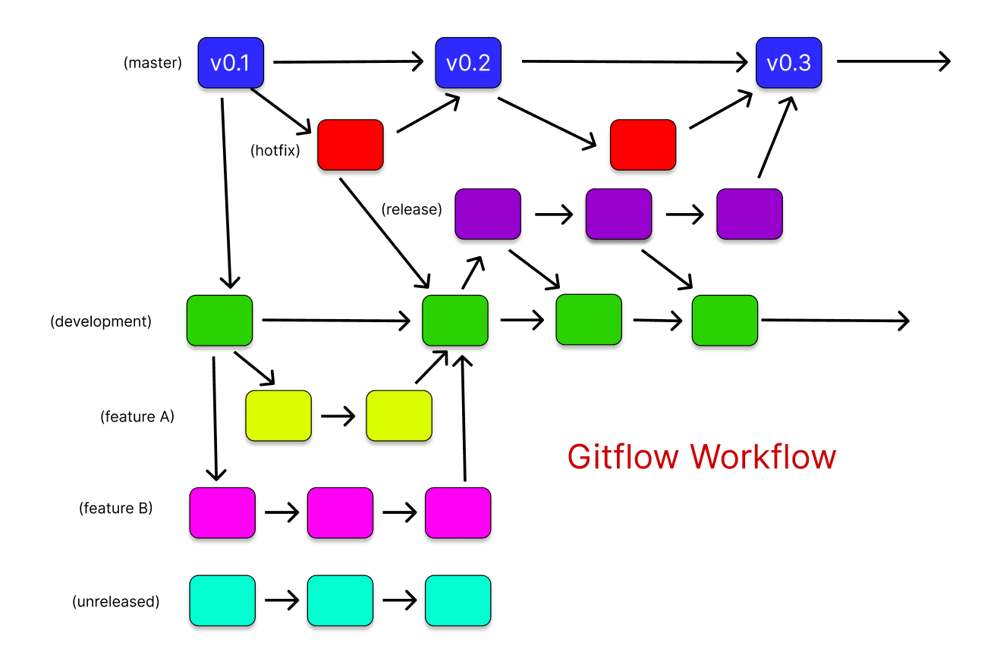

# Tipi di workflow

I workflow di Git si riferiscono alle tecniche o processi che i team di sviluppo utilizzano per collaborare e gestire il codice sorgente di un progetto utilizzando Git. Questi workflow possono variare a seconda delle esigenze specifiche del progetto, della dimensione del team, dello stile di gestione e di altri fattori.

Ogni workflow ha i suoi pro e i suoi contro, e la scelta del workflow giusto dipenderà dalle tue esigenze specifiche, dalla dimensione del team e dalla natura del progetto. Ricordiamoci che l'obiettivo di qualsiasi workflow dovrebbe essere quello di facilitare il lavoro in team e di mantenere il codice pulito e gestibile.

Ecco alcuni dei workflow più comuni utilizzati con Git:

---

## Feature Branch Workflow

Questo è il workflow più comune utilizzato dai team di sviluppo. Ogni nuova funzionalità viene sviluppata su un branch separato prima di essere unita al branch principale. Questo permette ai developer di lavorare in parallelo su diverse funzionalità senza interferire l'uno con l'altro.

---

## Gitflow Workflow

Questo workflow è una estensione del Feature Branch Workflow ed è particolarmente utile per i progetti con rilasci programmati. Ci sono due branch principali: master, che contiene il codice della versione di produzione, e develop, che serve come un'area di integrazione per le feature. Vari altri tipi di branch vengono utilizzati per sviluppare nuove funzionalità, preparare i rilasci (release) e risolvere rapidamente i problemi in produzione (hotfix).

---

## Forking Workflow

Questo workflow è spesso utilizzato nei progetti open source. Ogni developer "forka" il repository originale e lavora sulla propria copia. Quindi invia una "pull request" quando ha finito di lavorare sulla sua feature o ha risolto un bug. Questo workflow permette a chiunque di contribuire al progetto senza bisogno di avere accesso al repository originale.

---

## Centralized Workflow

Questo workflow è simile a quello utilizzato in sistemi di controllo versione centralizzati come SVN. Tutti gli sviluppatori lavorano sullo stesso branch (solitamente master) e le modifiche vengono committate direttamente in questo branch. Questo workflow è semplice, ma può portare a problemi se due sviluppatori stanno lavorando sulla stessa parte del codice allo stesso tempo.

---

## Trunk Based Development

In questo workflow, tutti gli sviluppatori lavorano su un unico branch (il "trunk"). Le modifiche vengono committate regolarmente (diverse volte al giorno) e il codice nel trunk dovrebbe essere sempre in uno stato deployabile (pronto alla pubblicazione). Questo richiede una buona suite di test automatizzati e pratiche di integrazione continua.

Ogni workflow ha i suoi vantaggi e svantaggi, e la scelta del workflow giusto dipende dalle esigenze specifiche del team e del progetto. Ad esempio, Gitflow potrebbe essere eccessivo per un piccolo progetto con un piccolo team, ma potrebbe essere perfetto per un grande progetto con molti sviluppatori e un ciclo di rilascio regolare. D'altra parte, un Centralized Workflow potrebbe essere sufficiente per un piccolo progetto, ma potrebbe diventare problematico in un progetto più grande con molte caratteristiche in sviluppo simultaneamente.

---

# Continuous Integration / Continuous Delivery

La Continuous Integration / Continuous Delivery (CI/CD) è un metodo di sviluppo del software che comporta l'integrazione continua del lavoro degli sviluppatori e la consegna o il rilascio continuo di nuove funzionalità o aggiornamenti al software esistente.

---

## Continuous Integration (CI)

La Continuous Integration (CI) è una pratica di sviluppo del software in cui gli sviluppatori uniscono continuamente le loro modifiche al codice in un repository centrale. Dopo ogni unione, il codice viene automaticamente testato per rilevare eventuali errori o bug. Questo approccio ha lo scopo di prevenire problemi a lungo termine dovuti all'integrazione del codice, riducendo il tempo necessario per rilasciare nuove modifiche del software.

Per esempio, quando uno sviluppatore termina di lavorare su una funzionalità o su una correzione, invia le sue modifiche al repository centrale. Queste modifiche vengono quindi automaticamente testate per verificare che non introducano nuovi bug nel software.

---

## Continuous Delivery (CD)

La Continuous Delivery (CD) è il passo successivo dopo la CI. Una volta che le modifiche al codice hanno superato con successo i test automatici, possono essere rilasciate in un ambiente di produzione. L'obiettivo è avere un sistema che permetta di rilasciare nuove modifiche ai clienti in modo rapido e sostenibile.

In altre parole, la CD automatizza il processo di rilascio del software, riducendo i tempi tra le modifiche del codice e il loro rilascio ai clienti.

Una pipeline CI/CD tipica può includere le seguenti fasi:
1. **Commit del codice**: lo sviluppatore invia le sue modifiche al repository centrale.
2. **Build del codice**: il sistema compila il codice in un formato eseguibile.
3. **Test automatici**: il sistema esegue una serie di test per rilevare eventuali errori o bug.
4. **Rilascio**: se tutti i test passano, le modifiche vengono rilasciate in un ambiente di produzione.

Questo processo è continuo, da qui il termine "Continuous Integration / Continuous Delivery". Il vantaggio principale è che consente di rilasciare software di alta qualità in modo più rapido e prevedibile, riducendo il rischio di errori critici in produzione.

