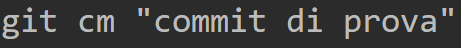
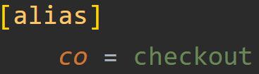

# Alias

Gli alias in Git sono scorciatoie o comandi personalizzati che rappresentano un comando Git più lungo. Possono essere estremamente utili per ridurre la quantità di digitazione necessaria per comandi Git comuni, complessi o difficili da ricordare.

Gli alias possono essere configurati tramite il comando `git config`. Quando creiamo un alias, Git lo memorizza nel nostro file di configurazione Git. Questi file di configurazione possono essere a livello di sistema, a livello globale (per tutti gli utenti e repository sul computer), o a livello di repository (solo per un singolo repository). Di solito, gli alias vengono configurati a livello globale.

---

## Creazione alias

Esistono due tipi di Alias che possiamo creare con Git: Globali e di Repository.

### Globali

Possiamo creare un alias globale, installato su tutta la nostra macchina ed utilizzarlo in ogni repository. Se ad esempio dovessimo digitare `git commit -m`, spesso, potremmo voler creare un alias per abbreviare questo comando.

Potremmo farlo con il seguente comando: `git config --global alias.cm 'commit -m'`. L'opzione `--global` creerà l'alias a livello globale. Dopo aver eseguito questo comando, possiamo digitare `git cm` invece di `git commit -m`.



Gli alias globali vengono memorizzati nel file di configurazione Git, che di solito si trova in `~/.gitconfig` per la configurazione globale. Per visualizzare solo gli alias globali:

```sh
git config --global --get-regexp alias
```

### Repository

Possiamo anche creare degli alias validi solo per una determinata repository, solo per un progetto. Basterà omettere l'opzione **--global**. Ad esempio, vogliamo creare un alias per git checkout: `git config alias.co checkout`

Per eseguire il checkout su dei commit, adesso possiamo utilizzare anche l'alias `git co [branch/commit]`.

Quando creiamo un alias a livello di repository, Git lo memorizza nel file di configurazione della repository, che si trova in *.git/config* nella cartella root della repository. Notiamo che viene aggiunta l'opzione `[alias]` nel file, con chiave - valore: alias = comando git.



NB:
1. È possibile editare direttamente questo file config, per modificare gli alias (ed altre voci).
2. Gli alias a livello di repository sovrascrivono gli alias a livello globale dello stesso nome. Quindi, se avessimo un alias a livello globale chiamato **co**, e poi creiamo un alias a livello di repository con lo stesso nome, l'alias a livello di repository sarà quello utilizzato quando eseguiremo `git co` in quella repository.
3. Possiamo visualizzare tutti gli alias, globali o di repo, eseguendo `git config --get-regexp alias`
4. Gli alias in Git, sia a livello globale che di repository, non vengono salvati all'interno della repository stessa, quindi non possono essere né pushati né pullati. Questo perché gli alias sono considerati configurazioni specifiche dell'utente e, di conseguenza, sono salvati nei file di configurazione di Git del nostro sistema locale, non nella repository del progetto.
5. Se desiderassimo condividere gli alias con altri utenti o su altre macchine, dovremo farlo manualmente. Una possibile soluzione potrebbe essere quella di creare un file di script che configura gli alias desiderati e quindi includere questo script nel nostro progetto. Gli altri utenti possono quindi eseguire lo script per configurare gli stessi alias sul loro sistema. Questo significa che ogni utente potrebbe avere preferenze diverse per gli alias e altri aspetti della configurazione di Git, quindi potrebbe non essere ideale imporre un set specifico di alias a tutti i collaboratori di un progetto.

---

## Combo di comandi

Gli alias possono anche rappresentare sequenze di comandi. Ad esempio, se spesso ci trovi a eseguire git pull seguito da git push, potresti voler creare un alias per eseguire entrambi i comandi insieme.

Esempio:

```sh
git config --global alias.sync '!git pull && git push'
```

Dopo aver eseguito questo comando, possiamo digitare `git sync` per eseguire i due comandi `git pull && git push` in simultanea. Questo comando potrebbe essere una valida alternativa all'operazione di sincronizzazione dei commit su VSCode, che fa esattamente il pull e push insieme.

